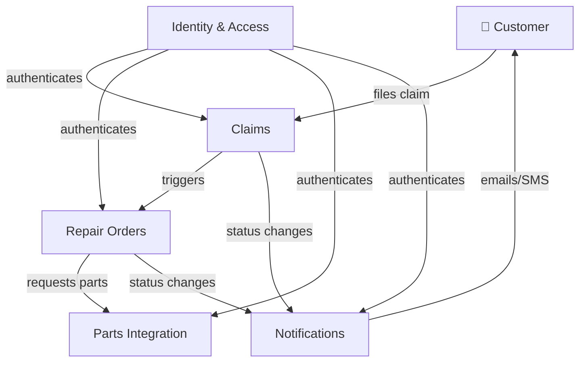

# 01 — Context and Goals

## Vision

Build a production-grade, cloud-native platform that manages the full lifecycle of a vehicle — from insurance claim intake through repair order execution, parts procurement, and customer notification — on Microsoft Azure, using modern .NET and proven architectural patterns.

The platform serves as both a functional system and a reference implementation demonstrating Senior Architect-level skills in DDD, CQRS, event-driven design, REST API design, security, observability, and incremental delivery.

## Stakeholders

| Role | Interest |
|---|---|
| **Workshop operator** | Create and track repair orders, assign technicians |
| **Claims handler** | Open claims, link to vehicles and repair orders, manage lifecycle |
| **Parts coordinator** | Manage parts catalog, create procurement requests |
| **Customer** | Receive status notifications, view claim and repair progress |
| **Platform engineer** | Deploy, monitor, scale, troubleshoot |
| **Security team** | Identity, authorization, compliance, audit trail |

## Business context

## Scope — in

- Claim management (intake, triage, decision, closure)
- Repair order lifecycle (create, assign, track, complete)
- Parts catalog and procurement requests
- Event-driven notification delivery (email, push — channel abstracted)
- Identity and access (Entra ID, RBAC, Managed Identity)
- Azure-hosted infrastructure with full IaC
- CI/CD with GitHub Actions and `azd`

## Scope — out (for now)

- Payment processing
- Fleet management / telematics
- Customer-facing mobile app (only backend APIs)
- AI features (deferred to phase 9+)
- Multi-tenant SaaS model

## Quality attribute goals

| Attribute | Target |
|---|---|
| **Modifiability** | Module changes must not require cross-module code changes |
| **Deployability** | Full environment provision + deploy in < 15 min via `azd up` |
| **Observability** | Distributed traces, structured logs, and metrics for every request |
| **Security** | No secrets in code; Managed Identity everywhere possible; RBAC enforced |
| **Testability** | Domain logic testable without infrastructure dependencies |
| **Recoverability** | Outbox guarantees at-least-once event delivery; idempotent consumers |
| **Cost control** | All Azure resources deletable in one command; local dev costs $0 |

## Constraints

- .NET 10, C#, ASP.NET Core
- Azure as cloud provider
- Microsoft Entra ID as identity provider
- Azure SQL as primary relational store
- No shared database ownership across future service boundaries
- All infrastructure defined as Bicep
- GitHub Actions for CI/CD
