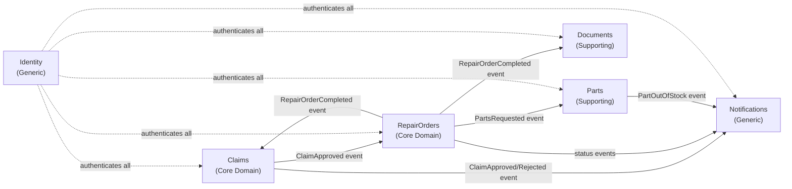

# 03 — Bounded Contexts

## Overview

Each bounded context owns its domain model, its data, and its internal language. No context shares a database table with another. Integration happens via domain events (internal, within the monolith) and integration events (external, via Service Bus when extracted to a microservice).

## Claims

| Property | Value |
|---|---|
| **Type** | Core Domain |
| **Team ownership** | Claims team |
| **Data store** | Azure SQL — schema `claims` |
| **Public API** | `POST /claims`, `GET /claims/{id}`, `PATCH /claims/{id}/decision` |
| **Produces events** | ClaimSubmitted, ClaimApproved, ClaimRejected, ClaimEscalated, ClaimClosed |
| **Consumes events** | RepairOrderCompleted |
| **Module path** | `src/Modules/Claims/` |

**Responsibilities:**
- Accept and validate claim submissions
- Manage claim lifecycle (open → in-investigation → decided → closed)
- Record handler notes and decisions
- Publish approval/rejection events for downstream contexts

**Does NOT own:**
- Repair order data
- Parts inventory
- Notification delivery

---

## RepairOrders

| Property | Value |
|---|---|
| **Type** | Core Domain |
| **Team ownership** | Workshop team |
| **Data store** | Azure SQL — schema `repairorders` |
| **Public API** | `POST /repair-orders`, `GET /repair-orders/{id}`, `PUT /repair-orders/{id}/status` |
| **Produces events** | RepairOrderCreated, RepairStarted, RepairOrderCompleted, PartsRequested |
| **Consumes events** | ClaimApproved, PartReserved, PartOutOfStock |
| **Module path** | `src/Modules/RepairOrders/` |

**Responsibilities:**
- Create repair orders when a claim is approved
- Assign orders to workshops and technicians
- Track repair task progress
- Request parts from the Parts context

---

## Parts

| Property | Value |
|---|---|
| **Type** | Supporting Domain |
| **Team ownership** | Parts team |
| **Data store** | Azure SQL — schema `parts` |
| **Public API** | `GET /parts`, `GET /parts/{id}`, `POST /parts/reservations` |
| **Produces events** | PartReserved, PartOutOfStock, ProcurementRequested |
| **Consumes events** | PartsRequested |
| **Module path** | `src/Modules/Parts/` |

**Responsibilities:**
- Maintain parts catalog and stock levels
- Handle reservation requests from RepairOrders
- Initiate procurement when stock is insufficient

---

## Notifications

| Property | Value |
|---|---|
| **Type** | Generic Subdomain |
| **Team ownership** | Platform team |
| **Data store** | Azure SQL — schema `notifications` |
| **Public API** | Internal only — no public REST endpoint in v1 |
| **Produces events** | NotificationSent, NotificationFailed |
| **Consumes events** | ClaimApproved, ClaimRejected, RepairOrderCreated, RepairOrderCompleted, PartOutOfStock |
| **Module path** | `src/Modules/Notifications/` |

**Responsibilities:**
- Deliver notifications via configured channels (email, SMS, push)
- Manage templates and retry logic
- Track delivery status

---

## Identity

| Property | Value |
|---|---|
| **Type** | Generic Subdomain |
| **Team ownership** | Platform team |
| **Data store** | Microsoft Entra ID (external) + local shadow table for profile data |
| **Public API** | No REST endpoints — token validation only |
| **Produces events** | (none in v1) |
| **Consumes events** | (none in v1) |
| **Module path** | `src/Modules/Identity/` |

**Responsibilities:**
- Token validation (JWT Bearer, Entra ID JWKS)
- RBAC enforcement via claims-based authorization
- Expose current user context to other modules
- Manage user profile shadow (display name, preferences)

**Does NOT own:**
- User credentials (owned by Entra ID)
- MFA / SSO configuration (owned by Entra ID)

---

## Documents

| Property | Value |
|---|---|
| **Type** | Supporting Domain |
| **Team ownership** | Platform team |
| **Data store** | MongoDB -- database `documents`, collection `invoices` |
| **Public API** | `POST /api/v1/invoices`, `GET /api/v1/invoices/{id}`, `GET /api/v1/invoices/by-repair-order/{repairOrderId}` |
| **Produces events** | InvoiceCreated, InvoiceIssued, InvoicePaid, InvoiceCancelled |
| **Consumes events** | (planned) RepairOrderCompleted |
| **Module path** | `src/Modules/Documents/` |

**Responsibilities:**
- Store invoices as MongoDB documents (variable line items, no fixed schema migrations)
- Manage invoice lifecycle: Draft to Issued to Paid / Cancelled
- Provide invoice retrieval by ID and by repair order
- Emit domain events on every lifecycle transition

**Does NOT own:**
- Repair order data (owned by RepairOrders)
- Payment processing (external system)
- Notification delivery (owned by Notifications)

**Why MongoDB (not SQL)?**
Invoices carry a variable number of line items with different tax/discount structures. Storing them as embedded documents avoids a join and allows the schema to evolve without migrations. See [ADR-015](05-architecture-decisions.md).

---
## Context evolution strategy

| Phase | Context state |
|---|---|
| Phase 1-4 | All contexts run as modules inside a single ASP.NET Core process |
| Phase 5-7 | Module boundaries enforced; no direct cross-module class references |
| Phase 8+ | Claims or RepairOrders extracted to independent service if team/scaling justifies it |
| Never | Notifications and Identity extracted — too generic, too stable |
