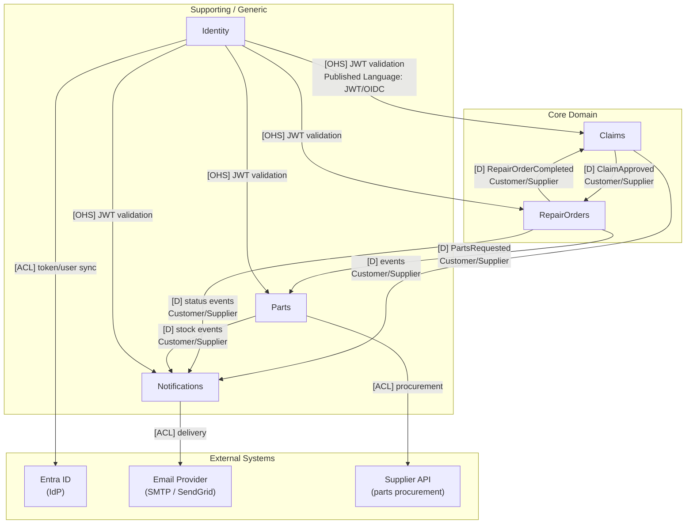
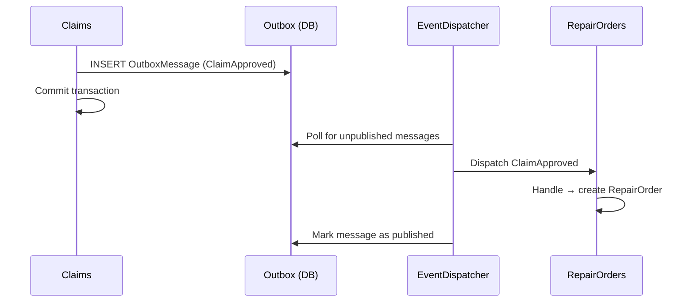
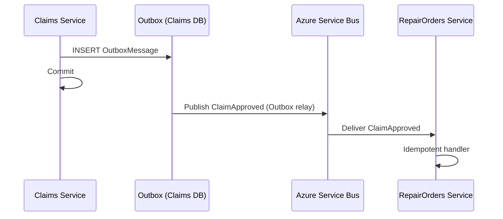

# 04 — Context Map

## Relationships



## Relationship types

| Relationship | Pattern | Description |
|---|---|---|
| Claims → RepairOrders | **Customer/Supplier** | Claims produces `ClaimApproved`; RepairOrders consumes it. Claims is upstream (supplier), RepairOrders is downstream (customer). |
| Claims → Notifications | **Customer/Supplier** | Claims publishes lifecycle events; Notifications consumes them. |
| RepairOrders → Parts | **Customer/Supplier** | RepairOrders requests part reservations; Parts fulfils them. |
| RepairOrders → Notifications | **Customer/Supplier** | RepairOrders publishes status events; Notifications delivers them. |
| Parts → Notifications | **Customer/Supplier** | Parts signals stock shortages; Notifications alerts coordinators. |
| RepairOrders → Claims | **Customer/Supplier** | RepairOrders reports completion back to Claims (bidirectional dependency — monitored for coupling risk). |
| Identity → all modules | **Open Host Service** | Identity exposes a token validation service consumed by all. Published Language: JWT / OIDC / Entra ID JWKS. |
| Identity → Entra ID | **Anti-Corruption Layer** | Identity translates Entra external concepts (object ID, tenant) into internal User/Role model. |
| Notifications → Email Provider | **Anti-Corruption Layer** | Notifications abstracts over delivery channels; provider-specific SDKs isolated behind ACL. |
| Parts → Supplier API | **Anti-Corruption Layer** | Parts isolates external supplier API schema from internal domain model. |

## Integration mechanics

### Phase 1-7: In-process (modular monolith)

All events are dispatched in-process using MediatR (or equivalent). The Outbox pattern persists events to the local database before dispatch, ensuring at-least-once delivery even if the handler fails.



### Phase 8+: Cross-service (Azure Service Bus)

When a context is extracted to an independent service, in-process dispatch is replaced by Service Bus publishing. The Outbox remains — only the transport changes.



## Anti-corruption layer examples

### Identity ACL

```
Entra ID concept          → Internal concept
─────────────────────────────────────────────
oid (object ID)           → UserId
roles claim               → Role[]
preferred_username        → Email
tid (tenant ID)           → (validated, not stored)
```

### Supplier API ACL

```
Supplier API concept      → Internal concept
─────────────────────────────────────────────
item_code                 → SKU
stock_qty                 → QuantityOnHand
delivery_lead_days        → LeadTimeDays
order_reference           → ProcurementRequestId
```
