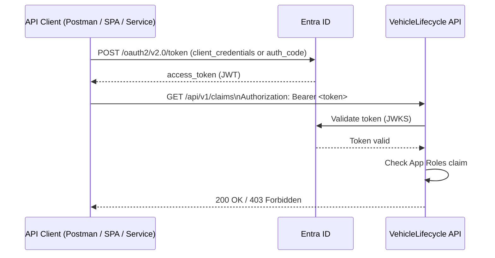

# 08 — Security Model

## Identity Provider

**Microsoft Entra ID** (formerly Azure AD) is the single identity provider for the platform.

- Protocol: OAuth 2.0 + OpenID Connect
- Token format: JWT (RS256)
- JWKS endpoint: auto-discovered from Entra ID metadata
- Tenant type: Single-tenant (one Entra ID tenant per environment)

## Authentication flow



## App Registrations

| Registration | Purpose |
|---|---|
| `VehicleLifecycle-API` | The platform API — exposes scopes and app roles |
| `VehicleLifecycle-Client-Dev` | Dev/test client (Postman, integration tests) |
| `VehicleLifecycle-CI` | Service Principal for GitHub Actions / `azd` deployments |

## App Roles (RBAC)

Defined on `VehicleLifecycle-API` registration:

| Role | Value | Description |
|---|---|---|
| Admin | `Platform.Admin` | Full access to all modules |
| Claims Handler | `Claims.Handler` | Create/update/decide claims |
| Workshop Coordinator | `Workshop.Coordinator` | Manage repair orders and assignments |
| Technician | `Workshop.Technician` | Update repair task status, request parts |
| Parts Coordinator | `Parts.Coordinator` | Manage parts catalog and procurement |
| Read Only | `Platform.ReadOnly` | Read all resources, no mutations |

Role-to-permission matrix: see [06-rest-api-guidelines.md](06-rest-api-guidelines.md#authorization-rbac)

## JWT claims used

| JWT claim | Usage |
|---|---|
| `oid` | Maps to internal `UserId` |
| `roles` | Array of App Role values; drives RBAC |
| `preferred_username` | Display / audit logging |
| `tid` | Validated against expected tenant ID |
| `aud` | Validated against API's client ID |

## Managed Identity

Service-to-service calls (API → Azure SQL, API → Key Vault, API → Service Bus) use **System-Assigned Managed Identity** — no passwords or connection string secrets in application config.

| Service | Auth method |
|---|---|
| Azure SQL | Managed Identity → `db_datareader` + `db_datawriter` role |
| Azure Key Vault | Managed Identity → Key Vault Secrets User role |
| Azure Service Bus | Managed Identity → Service Bus Data Sender + Receiver roles |
| Application Insights | Connection string from Key Vault (no secret rotation risk) |

## Key Vault usage

| Secret | Stored as |
|---|---|
| Application Insights connection string | KV secret |
| Entra ID tenant ID | KV secret (or App Setting) |
| Entra ID client ID (API registration) | App Setting (not sensitive) |
| Azure SQL server name | App Setting |
| Email provider API key | KV secret |
| Supplier API key | KV secret |

**Rule:** No secrets in `appsettings.json`, environment variables in source, or container image.

## Network security (Azure)

| Layer | Control |
|---|---|
| API exposure | Azure API Management (rate limiting, auth policy) |
| VNet | App Service / Container App in dedicated subnet |
| SQL | Private Endpoint — no public internet access |
| Key Vault | Private Endpoint or trusted services only |
| Service Bus | Private Endpoint for production |
| Outbound | Managed Identity replaces SAS keys |

## Threat model — top risks

| Threat | Mitigation |
|---|---|
| Token theft | Short expiry (1h), no refresh token in API clients |
| Broken authorization | RBAC enforced at controller and handler level; tests cover role boundaries |
| Secret exposure | Key Vault + Managed Identity; no secrets in code or logs |
| SQL injection | EF Core parameterized queries; no raw SQL with user input |
| Insecure direct object reference | All queries filter by tenant/user scope |
| Denial of service | APIM rate limiting; Azure DDoS Basic on VNet |
| Dependency confusion | NuGet packages locked with central package management |

## CI/CD security

- GitHub Actions uses OIDC federation to Entra ID — no long-lived secrets in GitHub
- `azd pipeline config` sets up the OIDC trust automatically
- Deployment Service Principal has minimal permissions: `Contributor` on resource group only
- Secrets not printed in logs (`--no-prompt` flags where applicable)

---

## Authentication modes

The platform supports two authentication modes, selected at startup via `Features:DisableAuthentication`.

### Mode 1 — Entra ID JWT Bearer (default / production)

Active when `Features:DisableAuthentication = false` (the default in `appsettings.json` and Azure).

Flow:
1. Client obtains a JWT from Entra ID (`/oauth2/v2.0/token`).
2. Request arrives with `Authorization: Bearer <token>`.
3. `Microsoft.Identity.Web` validates the JWT against the Entra ID JWKS endpoint.
4. `aud`, `tid`, `roles`, and `scp` claims are checked; requests that fail receive `401` or `403`.
5. `ICurrentUser` is populated from `oid`, `roles`, and `preferred_username`.

Required configuration (supplied via Key Vault / env vars — never in source-controlled files):

```json
"AzureAd": {
  "Instance": "https://login.microsoftonline.com/",
  "TenantId":  "<Entra tenant GUID>",
  "ClientId":  "<API app registration client ID>",
  "Audience":  "api://<client-id>"
}
```

### Mode 2 — Local development bypass

Active when `Features:DisableAuthentication = true` (set in `appsettings.Development.json`).

- `LocalDevAuthHandler` (`src/Modules/Identity/VehicleLifecycle.Identity.Api/Security/LocalDevAuthHandler.cs`) automatically authenticates every request.
- The synthetic principal carries **all** App Roles (`Platform.Admin`, `Claims.Handler`, `Workshop.Coordinator`, `Parts.Coordinator`, `Platform.ReadOnly`) and all API scopes.
- A `WARNING` is written to the log at startup: *Authentication is DISABLED — all requests are automatically authenticated as local dev user.*
- **No Entra ID tenant, client ID, or secret is required.**

### Configuration matrix

| Environment | `Features:DisableAuthentication` | Auth scheme | Entra ID needed |
|---|---|---|---|
| `appsettings.json` (production base) | `false` | Microsoft.Identity.Web JWT Bearer | Yes |
| `appsettings.Development.json` (local) | `true` | `LocalDevAuthHandler` (bypass) | **No** |
| Azure Container Apps (`aca.bicep` env var) | `false` (explicit) | Microsoft.Identity.Web JWT Bearer | Yes |

### Setting options

**Option A — bypass for local, Entra for Azure (current default)**

```json
// appsettings.Development.json  (Platform Host + RepairOrders Service)
{ "Features": { "DisableAuthentication": true } }

// appsettings.json  (also enforced by ACA env var Features__DisableAuthentication=false)
{ "Features": { "DisableAuthentication": false } }
```

**Option B — real Entra ID everywhere**

1. Set `Features:DisableAuthentication = false` in `appsettings.Development.json`.
2. Supply Entra ID values via [User Secrets](https://learn.microsoft.com/aspnet/core/security/app-secrets):

```bash
dotnet user-secrets set "AzureAd:TenantId" "<guid>"      --project src/Platform/VehicleLifecycle.Platform.Host
dotnet user-secrets set "AzureAd:ClientId" "<guid>"      --project src/Platform/VehicleLifecycle.Platform.Host
dotnet user-secrets set "AzureAd:Audience" "api://<id>"  --project src/Platform/VehicleLifecycle.Platform.Host
```

3. Obtain a token via Postman using the `VehicleLifecycle-Client-Dev` app registration and attach `Authorization: Bearer <token>` to every request.

**Option C — bypass everywhere (demo / prototype only)**

Set `Features:DisableAuthentication = true` in `appsettings.json`.

> ⚠️ **Never deploy to a shared or production environment with this setting.**

---

## Authorization policies

Defined in `IdentityModuleExtensions`, applied uniformly to Platform Host and RepairOrders Service:

| Policy | Required role(s) | Required scope |
|---|---|---|
| `ClaimsRead` | `Claims.Handler`, `Platform.Admin`, `Platform.ReadOnly` | `claims.read` |
| `ClaimsWrite` | `Claims.Handler`, `Platform.Admin` | `claims.write` |
| `RepairOrdersRead` | `Workshop.Coordinator`, `Platform.Admin`, `Platform.ReadOnly` | `repairorders.read` |
| `RepairOrdersWrite` | `Workshop.Coordinator`, `Platform.Admin` | `repairorders.write` |
| `PartsRead` | `Parts.Coordinator`, `Platform.Admin`, `Platform.ReadOnly` | `parts.read` |
| `PartsWrite` | `Parts.Coordinator`, `Platform.Admin` | `parts.write` |
| `DocumentsRead` | `Platform.Admin`, `Platform.ReadOnly` | `documents.read` |
| `DocumentsWrite` | `Platform.Admin` | `documents.write` |

In bypass mode all policies pass because `LocalDevAuthHandler` injects every role and scope into the synthetic principal.
