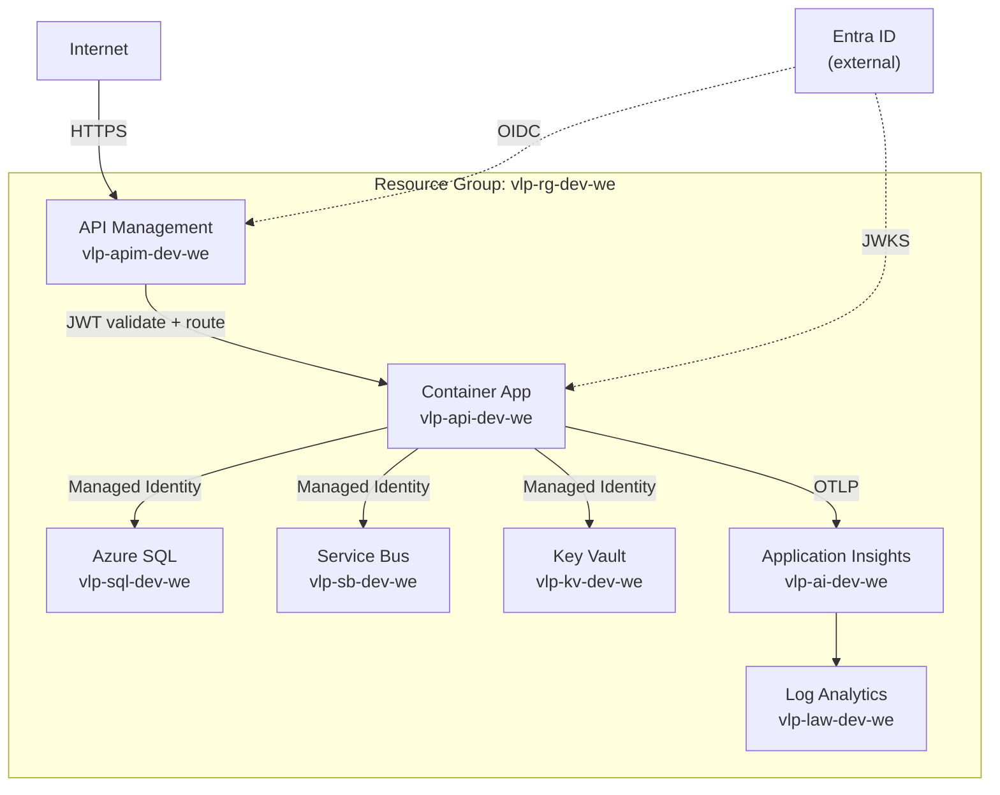
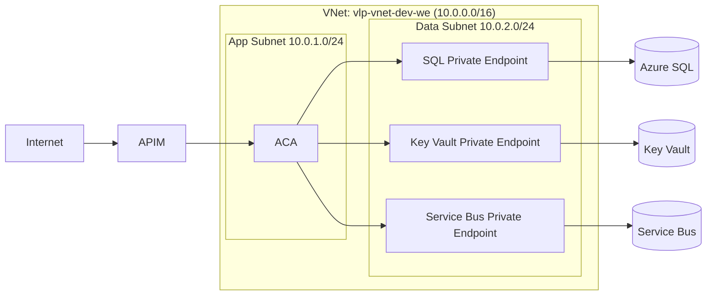

# 09 — Azure Topology

## Resource naming convention

```
vlp-{component}-{environment}-{region-short}

Examples:
  vlp-api-dev-we          (Container App / App Service)
  vlp-sql-dev-we          (Azure SQL Server)
  vlp-sb-dev-we           (Service Bus namespace)
  vlp-kv-dev-we           (Key Vault)
  vlp-ai-dev-we           (Application Insights)
  vlp-law-dev-we          (Log Analytics Workspace)
  vlp-apim-dev-we         (API Management)
  vlp-rg-dev-we           (Resource Group)
```

Environments: `dev`, `tst`, `prd`  
Region short: `we` = West Europe

## Resource map



## Azure resources per environment

| Resource | SKU (dev) | SKU (prd) | Teardown safe? |
|---|---|---|---|
| Container Apps Environment | Consumption | Dedicated | ✅ yes |
| Container App (API) | 0.25 vCPU / 0.5 GB | 1 vCPU / 2 GB | ✅ yes |
| Azure SQL Server | — | — | ✅ yes |
| Azure SQL Database | Basic (5 DTU) | Standard S2 | ✅ yes |
| Service Bus Namespace | Basic | Standard | ✅ yes |
| Key Vault | Standard | Standard | ✅ yes (with --purge) |
| Application Insights | Pay-per-use | Pay-per-use | ✅ yes |
| Log Analytics Workspace | Pay-per-use | Pay-per-use | ✅ yes |
| API Management | Developer (dev) | Standard v2 | ✅ yes |

> **Note:** API Management Developer SKU is ~$50/month — consider provisioning only when testing APIM policies. Use direct Container App URL for daily dev.

## Entra ID resources (NOT in resource group — persist across teardowns)

| Resource | Notes |
|---|---|
| App Registration: `VehicleLifecycle-API` | Stays forever, $0 cost |
| App Registration: `VehicleLifecycle-Client-Dev` | Stays forever, $0 cost |
| App Registration: `VehicleLifecycle-CI` | Stays forever, $0 cost |
| App Roles definitions | Stays forever |
| OIDC Federated Credential (GitHub Actions) | Stays forever |

## Networking



> Dev environment may omit VNet and Private Endpoints to reduce cost and complexity. Production must have them.

## Deployment topology

```
GitHub Actions (azd deploy)
  ↓
  Build Docker image
  ↓
  Push to Azure Container Registry (vlp-acr-dev-we)
  ↓
  azd deploy → Container App revision update
  ↓
  Container App pulls image via Managed Identity
```

## Cost estimate (dev, running 8h/day)

| Resource | Est. monthly (8h/day) |
|---|---|
| Container App (Consumption) | ~$2–5 |
| Azure SQL Basic | ~$5 |
| Service Bus Basic | ~$0.10 |
| Key Vault | ~$0.03 |
| App Insights + Log Analytics | ~$1–3 |
| **Total (excl. APIM)** | **~$8–13/month** |

`azd down` at end of each day reduces actual spend proportionally.
