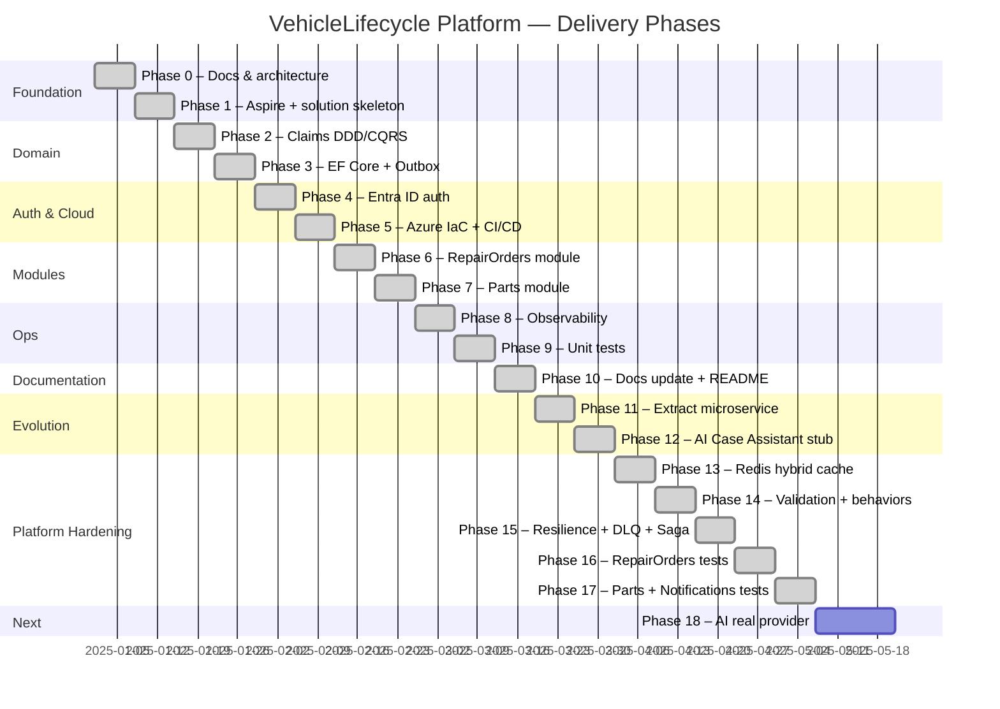

# 10 — Delivery Roadmap

## Status

| Phase | Title | Status | Commit |
|-------|-------|--------|--------|
| 0 | Docs & architecture | ✅ Done | — |
| 1 | Aspire + solution skeleton | ✅ Done | `6a236fe` |
| 2 | Claims domain — DDD/CQRS | ✅ Done | `1aa5749` |
| 3 | EF Core 10 + transactional outbox | ✅ Done | `efd3ea7` |
| 4 | Entra ID auth (JWT Bearer + RBAC) | ✅ Done | `07cac00` |
| 5 | Azure IaC (Bicep) + azd + Dockerfile + GitHub Actions | ✅ Done | `24bb25e` |
| 6 | RepairOrders module (full DDD/CQRS/EF/Outbox) | ✅ Done | `8780a49` |
| 7 | Parts module (full DDD/CQRS/EF/Outbox) | ✅ Done | `8780a49` |
| 8 | Observability — OTel, Azure Monitor, health checks, correlation ID | ✅ Done | `3f8eccd` |
| 9 | Unit tests — Claims domain, application handlers, middleware | ✅ Done | `352e717` |
| 10 | Documentation update + README | ✅ Done | `ebe9ebf` |
| 11 | Extract RepairOrders to microservice (Service Bus) | ✅ Done | `f862c92` |
| 12 | AI Case Assistant (stub, feature-flagged) | ✅ Done | `63c83ed` |
| 13 | Redis hybrid cache — L1 + L2 idempotency | ✅ Done | `30e4525` |
| 14 | FluentValidation + MediatR behaviors + rate limiting | ✅ Done | `7abb133` |
| 15 | Service Bus resilience (Polly) + DLQ handling + RepairOrder Saga | ✅ Done | `bd216bc` |
| 16 | Unit tests — RepairOrders domain + application | ✅ Done | `a3c22de` |
| 17 | Unit tests — Parts domain + application + Notifications (178 total) | ✅ Done | `daea956` |
| 18 | AI Case Assistant — real provider (Ollama / Azure OpenAI) | 🔜 Next | — |

## Overview

Incremental delivery — each phase produces working, runnable software. No phase depends on a future phase to compile or run.

---

## Phase 0 — Documentation and architecture ✅

**Goal:** All architecture decisions documented before writing production code.

Deliverables:
- `docs/01` through `docs/12`
- `README.md`
- `.gitattributes`, `.gitignore`
- GitHub repo initialized

---

## Phase 1 — .NET Aspire + solution skeleton

**Goal:** `dotnet run --project src/AppHost` starts the full local stack.

Deliverables:
- `src/AppHost` — Aspire orchestration project
- `src/VehicleLifecycle.Platform.slnx`
- Empty project stubs: all modules × 4 layers (Domain, Application, Infrastructure, Api)
- `src/BuildingBlocks/SharedKernel`, `Contracts`, `Observability`
- SQL Server container registered in AppHost
- Service Bus emulator registered in AppHost
- Aspire Dashboard accessible locally

---

## Phase 2 — Domain layer

**Goal:** All aggregates, value objects, domain events, and repository interfaces defined. No infrastructure, no EF Core, no HTTP.

Deliverables (per module):
- Aggregate roots and entities
- Value objects
- Domain events (internal)
- Repository interfaces (ports)
- Domain exceptions
- Unit tests for aggregate invariants

---

## Phase 3 — Application layer (CQRS)

**Goal:** All commands and queries implemented with MediatR handlers. Domain logic exercised through application layer. No real DB yet (in-memory or stub repos).

Deliverables (per module):
- Command DTOs + handlers
- Query DTOs + handlers
- Application service interfaces
- Validation (FluentValidation)
- Integration event DTOs (for Outbox)
- Unit tests for handlers

---

## Phase 4 — REST APIs + OpenAPI

**Goal:** All endpoints respond correctly. Swagger/Scalar UI works. No auth yet (AllowAnonymous in dev).

Deliverables:
- ASP.NET Core controllers per module
- Route and HTTP method mapping per guidelines
- Problem Details error handling middleware
- OpenAPI document with ProducesResponseType
- Minimal integration tests (WebApplicationFactory)

---

## Phase 5 — Authentication and authorization

**Goal:** All endpoints protected. RBAC enforced. Managed Identity plumbed.

Deliverables:
- JWT Bearer middleware configured (Entra ID)
- App Roles policy definitions
- `[Authorize(Roles = "...")]` on all controllers
- Identity module: current user context service
- Entra ID App Registration documented and scripted
- Integration tests with test tokens

---

## Phase 6 — Persistence and EF Core

**Goal:** Data survives restart. EF Core migrations baseline created.

Deliverables:
- EF Core `DbContext` per module (separate schemas)
- Entity configurations (Fluent API)
- Repository implementations
- EF Core migrations (initial)
- Azure SQL + SQL Server container connection via Managed Identity / connection string
- Integration tests with Testcontainers

---

## Phase 7 — Outbox pattern and event dispatch

**Goal:** Domain events reliably dispatched in-process. Foundation for Service Bus integration.

Deliverables:
- `OutboxMessage` entity and EF configuration
- Outbox background worker (polling)
- MediatR `INotificationHandler` wiring
- Idempotency table (`ProcessedEvents`)
- Integration tests proving at-least-once delivery

---

## Phase 8 — Azure IaC (Bicep) + azd

**Goal:** `azd up` provisions all Azure resources and deploys the app. `azd down` removes everything.

Deliverables:
- `infra/main.bicep` + module files
- `azure.yaml` (azd manifest)
- Dockerfile (multi-stage, .NET 10)
- `azd up` / `azd down` validated end-to-end
- Cost estimate documented

---

## Phase 9 — CI/CD (GitHub Actions)

**Goal:** Push to `main` → auto deploy to dev. Manual trigger → teardown.

Deliverables:
- `.github/workflows/deploy.yml` (build + test + azd deploy)
- `.github/workflows/teardown.yml` (manual + scheduled 20:00)
- OIDC federation to Entra ID (no GitHub secrets with passwords)
- Build status badge in README

---

## Phase 10 — Observability and operational readiness

**Goal:** Every request traceable end-to-end. Health endpoints green.

Deliverables:
- OpenTelemetry traces, logs, metrics configured
- Application Insights export on Azure
- `GET /health` (liveness) and `GET /health/ready` (readiness)
- Structured logging with correlation IDs
- Alerting rules (basic) in Bicep

---

## Phase 11 — Extract one module to microservice

**Goal:** Prove the modular monolith can be decomposed. Claims or RepairOrders extracted.

Deliverables:
- RepairOrders moved to a standalone Container App (`repairorders-service`)
- Service Bus (Standard SKU) replaces in-process event dispatch for that boundary
- Topic `repair-orders` + subscription `platform-host` declared in Bicep
- AppHost updated with new project
- `RepairOrdersEventConsumer` in Platform.Host with IMemoryCache idempotency guard (TTL 24 h)
- `Dockerfile.RepairOrders` + `azure.yaml` entry for `repairorders-service`
- Shared Managed Identity extracted to `identity.bicep` (breaks circular Bicep dependency)

**Status:** ✅ Complete (commits `f862c92`, `4cedf3a`, and IaC/idempotency additions)

---

## Phase 12 — AI Case Assistant

**Goal:** AI triage assistant for claims, behind existing APIs. Feature-flagged; off by default.

Deliverables:
- `IClaimAiAssistant` interface in Claims.Application.Contracts
- `NullClaimAiAssistant` (null object) in Claims.Infrastructure — always active, returns placeholder
- `POST /api/v1/claims/{id}/summarize` endpoint (available immediately; returns placeholder when AI is disabled)
- Feature flag `Features:AiAssistant:Enabled` in `appsettings.json` (default: `false`)
- To activate: set flag to `true` and register a real provider (e.g. `OllamaClaimAiAssistant` for self-hosted, or Azure AI Foundry)

**Status:** ✅ Complete — stub implemented. AI inactive (placeholder returned). Ready for Ollama or Azure OpenAI provider.

---

## Phase 13 — Redis Hybrid Cache (L1 + L2)

**Goal:** Cross-instance correctness for Service Bus idempotency. Hybrid cache strategy documented and implemented.

Deliverables:
- Redis registered via Aspire (`AddRedis("redis").RunAsContainer()`) and Azure Cache for Redis (Bicep)
- `RepairOrdersEventConsumer` migrated from `IMemoryCache` to `IDistributedCache` (Redis L2)
- L1 (`IMemoryCache`) retained for feature flag snapshots and per-request local data
- L2 (`IDistributedCache` / Redis) used wherever cross-instance consistency is required
- Query read-through pattern: L1 (TTL ~30 s) → L2 (TTL ~5 min) → database
- ADR-009 recorded
- Full diagrams in `docs/19-caching-architecture.md`

**Status:** ✅ Complete (commit `30e4525`)

---

## Phase 14 — FluentValidation + MediatR Behaviors + Rate Limiting

**Goal:** Request validation, cross-cutting pipeline behaviors, and API-level rate limiting.

Deliverables:
- `FluentValidation 12.0.0` registered per module
- MediatR pipeline behaviors in SharedKernel:
  - `ValidationBehavior<TRequest, TResponse>` — runs FluentValidation before handler
  - `LoggingBehavior<TRequest, TResponse>` — structured log entry + exit with elapsed time
  - `PerformanceBehavior<TRequest, TResponse>` — warning when handler exceeds 500 ms
- Module validators: `CreateRepairOrderCommandValidator`, `CreateClaimCommandValidator`, etc.
- ASP.NET Core rate limiting: fixed-window policy `api` (100 req / 1 min / IP) in Platform.Host and RepairOrders.Service
- All endpoints decorated with `RequireRateLimiting("api")`

**Status:** ✅ Complete (commit `7abb133`)

---

## Phase 15 — Service Bus Resilience + DLQ Handling + RepairOrder Saga

**Goal:** Production-grade messaging reliability and a lightweight saga for RepairOrder lifecycle.

Deliverables:
- **Service Bus resilience pipeline** (Polly `ResiliencePipeline`):
  - Retry: 3 attempts, exponential back-off (2 s base), jitter
  - Circuit breaker: 5 failures in 30 s → open for 15 s
  - Applied in both outbox dispatcher and event consumer
- **Dead-letter queue handling** in `RepairOrdersEventConsumer`:
  - Transient faults → `AbandonMessageAsync` (SB retries)
  - Deserialization errors → `DeadLetterMessageAsync` with reason
  - Unknown event type → `CompleteMessageAsync` + warning log
- **DeadLetterMonitorService** (`IHostedService`) — polls DLQ every 5 min, logs unprocessed messages to Application Insights
- **RepairSaga state machine** (`RepairSagaState`):
  - States: `Created → WorkStarted → Completed | Cancelled`
  - EF Core entity + `RepairSagaDbContext` + migration
  - `IRepairSagaRepository` + EF implementation
  - `StartRepairOrderCommand` + `StartRepairOrderCommandHandler` — proper work-start step
  - `CompleteRepairOrderCommandHandler` — compensating `RecordWorkStarted()` only when saga is still `Created`
  - `POST /api/v1/repair-orders/{id}/start` endpoint added
- ADR-010 (FluentValidation strategy), ADR-011 (Saga), ADR-012 (Resilience) recorded

**Status:** ✅ Complete (commits `91cd4d5`, `bd216bc`, `18f8024`)

---

## Phase 16 — Unit Tests: RepairOrders Domain + Application

**Goal:** Comprehensive test coverage for the RepairOrders bounded context.

Deliverables:
- `VehicleLifecycle.RepairOrders.Domain.Tests`:
  - `RepairOrderTests` — aggregate lifecycle, domain events, guard conditions, total amount
  - `RepairSagaStateTests` — saga state transitions, cancellation guards
- `VehicleLifecycle.RepairOrders.Application.Tests`:
  - `CreateRepairOrderCommandHandlerTests`
  - `StartRepairOrderCommandHandlerTests`
  - `CompleteRepairOrderCommandHandlerTests`
  - `CreateRepairOrderCommandValidatorTests`
  - `BehaviorTests` — ValidationBehavior, LoggingBehavior, PerformanceBehavior
- `InternalsVisibleTo` added to `RepairOrders.Application.csproj` for test access
- NSubstitute used for all repository mocks; NullLogger for behavior tests

**Status:** ✅ Complete (commit `a3c22de`)

---

## Phase 17 — Unit Tests: Parts Domain + Application + Notifications

**Goal:** Full test coverage for Parts and Notifications bounded contexts. Total suite across all projects: **178 tests, 0 failures**.

Deliverables:
- `VehicleLifecycle.Parts.Domain.Tests` (37 tests):
  - `PartTests` — Register, AdjustStock, UpdatePrice, domain events, guard conditions
  - `PartNumberTests` — normalization to uppercase, max-length guard, value-object equality
  - `MoneyTests` — amount/currency validation, equality, ToString format
- `VehicleLifecycle.Parts.Application.Tests` (31 tests):
  - `RegisterPartCommandHandlerTests` — handler creates Part, normalizes PartNumber, calls repo
  - `AdjustStockCommandHandlerTests` — stock delta, not-found, below-zero guard
  - `RegisterPartCommandValidatorTests` — all FluentValidation rules (name, category, currency, price)
  - `AdjustStockCommandValidatorTests` — delta ≠ 0, empty reason, max-length
- `VehicleLifecycle.Notifications.Tests` (11 tests):
  - `LoggingNotificationServiceTests` — log emission, orderId/customerId in message, cancellation
  - `NotificationsInfrastructureExtensionsTests` — DI registration, Scoped lifetime, scope singleton
- `InternalsVisibleTo` added to `Parts.Application.csproj`; `CapturingLogger<T>` helper avoids NSubstitute / strong-named assembly limitation

**Status:** ✅ Complete (commits `3d55886`, `daea956`)

---

## Phase 18 — AI Case Assistant — Real Provider

**Goal:** Replace the `NullClaimAiAssistant` stub with a real AI provider (Ollama self-hosted or Azure OpenAI / AI Foundry).

Deliverables:
- `OllamaClaimAiAssistant`: calls Ollama REST `/api/chat` with configurable model (default: `mistral`)
- `AzureOpenAiClaimAiAssistant`: calls Azure OpenAI via `Azure.AI.OpenAI` SDK; keyless auth via `DefaultAzureCredential`
- `AiAssistantOptions`: strongly-typed config bound from `AiAssistant` section
- Provider selected at startup via `AiAssistant:Provider` (`"Ollama"` | `"AzureOpenAI"`)
- `IHttpClientFactory` named client `"Ollama"` with 120 s timeout
- **Azure OpenAI disabled by default** (`Features:AiAssistant:Enabled = false` in production)
- `appsettings.Development.json`: Ollama enabled locally (`Enabled = true`, `Provider = "Ollama"`)
- `NullClaimAiAssistant` retained as fallback when feature flag is off

**Status:** ✅ Complete (commit `5f69add`)

---

## Phase 19 — Documents Module (MongoDB-backed Invoices)

**Goal:** Add the **Documents** bounded context to the Platform Host for generating and managing
invoices linked to completed repair orders.

Deliverables:

- `VehicleLifecycle.Documents.Domain` — `Invoice` aggregate root, `InvoiceLineItem` value object,
  `InvoiceId` strongly-typed ID, lifecycle state machine (Draft → Issued → Paid / Cancelled),
  domain events (`InvoiceCreated`, `InvoiceIssued`, `InvoicePaid`, `InvoiceCancelled`)
- `VehicleLifecycle.Documents.Application` — `CreateInvoiceCommand` + validator + handler,
  `GetInvoiceQuery` + `GetInvoicesByRepairOrderQuery` handlers, `IInvoiceRepository` port,
  `InvoiceMapper` for query DTOs
- `VehicleLifecycle.Documents.Infrastructure` — MongoDB persistence via `Aspire.MongoDB.Driver`,
  `MongoInvoiceRepository`, `InvoiceIdSerializer`, `DocumentsBsonConfiguration`
- `VehicleLifecycle.Documents.Api` — `AddDocumentsModule` / `MapDocumentsEndpoints`, three
  Minimal API endpoints protected by `documents.read` / `documents.write` scopes
- `AppHost.cs` — `builder.AddMongoDB("mongodb").WithDataVolume()` wired to platform-host
- `Program.cs` — `AddDocumentsModule()` + `MapDocumentsEndpoints()` registered
- `AppScopes` — `DocumentsRead` / `DocumentsWrite` constants added to `AppPermissions.cs`
- ADR-015 — documents the MongoDB technology choice
- **Tests:**
  - `VehicleLifecycle.Documents.Domain.Tests` — invoice lifecycle, totals, event emission
  - `VehicleLifecycle.Documents.Application.Tests` — handler + validator tests

**Status:** ✅ Complete (commit `686ff6f`)

