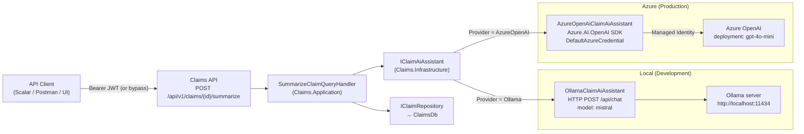

# 12 — AI Case Assistant

> **Status: Implemented (Phase 18).** The dual-provider AI assistant is active.
> Use `Features:AiAssistant:Enabled` to control activation per environment.

## Overview

The **AI Case Assistant** generates a plain-text, 2-3 sentence summary of an insurance claim on demand. It is wired behind the existing Claims API — no new public surface area — and accessible to any caller with the `claims.read` scope or `Claims.Handler` / `Platform.Admin` role.

```
POST /api/v1/claims/{id}/summarize
→ { "claimId": "...", "summary": "..." }
```

---

## Architecture



---

## Provider selection

The active provider is chosen at **startup** based on configuration — no runtime switching:

| Config key | Value | Effect |
|---|---|---|
| `Features:AiAssistant:Enabled` | `false` (default) | `NullClaimAiAssistant` — placeholder response, no AI call |
| `Features:AiAssistant:Enabled` | `true` + `AiAssistant:Provider = "Ollama"` | `OllamaClaimAiAssistant` |
| `Features:AiAssistant:Enabled` | `true` + `AiAssistant:Provider = "AzureOpenAI"` | `AzureOpenAiClaimAiAssistant` |

**Default by environment:**

| Environment | Enabled | Provider |
|---|---|---|
| `appsettings.json` (production base) | `false` | `Ollama` (irrelevant — disabled) |
| `appsettings.Development.json` | `true` | `Ollama` |

---

## Implementation classes

| Class | Project | Description |
|---|---|---|
| `IClaimAiAssistant` | `Claims.Application` | Interface — `SummarizeClaimAsync(Guid, CancellationToken)` |
| `NullClaimAiAssistant` | `Claims.Infrastructure` | No-op fallback; returns placeholder string |
| `OllamaClaimAiAssistant` | `Claims.Infrastructure` | Calls Ollama `/api/chat`; uses `IHttpClientFactory` named client `"Ollama"` with 120 s timeout |
| `AzureOpenAiClaimAiAssistant` | `Claims.Infrastructure` | Calls Azure OpenAI via `Azure.AI.OpenAI` SDK; auth via `DefaultAzureCredential` (no API keys) |
| `AiAssistantOptions` | `Claims.Infrastructure` | Strongly-typed config bound from `AiAssistant` section |
| `LocalDevAuthHandler` | `Identity.Api` | No-op auth scheme used when `Features:DisableAuthentication = true` |

---

## Configuration reference

### Production (`appsettings.json` base)

```json
{
  "Features": {
    "AiAssistant": { "Enabled": false },
    "DisableAuthentication": false
  },
  "AiAssistant": {
    "Provider": "Ollama",
    "Ollama": { "BaseUrl": "http://localhost:11434", "Model": "mistral" },
    "AzureOpenAI": { "Endpoint": "", "DeploymentName": "gpt-4o-mini" }
  }
}
```

### Local development (`appsettings.Development.json`)

```json
{
  "Features": {
    "AiAssistant": { "Enabled": true },
    "DisableAuthentication": true
  },
  "AiAssistant": {
    "Provider": "Ollama",
    "Ollama": { "BaseUrl": "http://localhost:11434", "Model": "mistral" }
  }
}
```

### Azure OpenAI (activate when ready)

Set via environment variable or Key Vault — **not** in source-controlled config:

```json
{
  "Features": { "AiAssistant": { "Enabled": true } },
  "AiAssistant": {
    "Provider": "AzureOpenAI",
    "AzureOpenAI": {
      "Endpoint": "https://<your-resource>.openai.azure.com/",
      "DeploymentName": "gpt-4o-mini"
    }
  }
}
```

Authentication is via `DefaultAzureCredential` — assign the **Cognitive Services OpenAI User** role to the Managed Identity on the Azure OpenAI resource. No API key needed.

---

## Prompt design

Both providers use the same prompt template:

```
Summarize the following insurance claim in 2-3 sentences:
- Claim ID : {id}
- Customer : {customerId}
- Vehicle  : {year} {make} {model} (VIN: {vin})
- Status   : {status}
- Damage   : {damageText}
- Submitted: {submittedAt:O}
```

---

## Constraints (unchanged from original design)

- AI features are behind an existing endpoint — no new public surface area.
- Results are **advisory** — never auto-approved; human in the loop required.
- Customer data does not leave the tenant boundary when using Azure OpenAI (data residency guaranteed by Azure region selection).
- When AI is unavailable, `NullClaimAiAssistant` returns a placeholder — claim workflow is never blocked.

---

## Azure resources required (when activating Azure OpenAI)

| Resource | Notes |
|---|---|
| Azure OpenAI resource | Region must support `gpt-4o-mini`; Standard or Provisioned SKU |
| Model deployment | Named `gpt-4o-mini` (or update `AiAssistant:AzureOpenAI:DeploymentName`) |
| Managed Identity | Assign **Cognitive Services OpenAI User** role on the Azure OpenAI resource |

---

## ADR reference

See [ADR-013 — AI Case Assistant provider strategy](05-architecture-decisions.md#adr-013).

