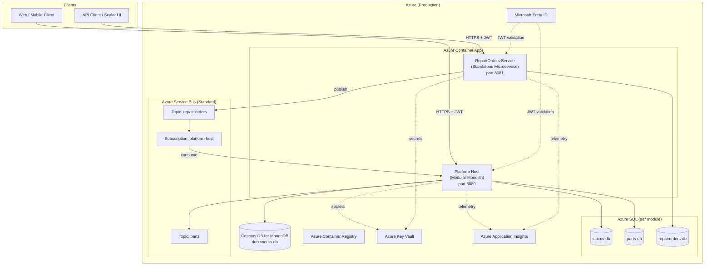
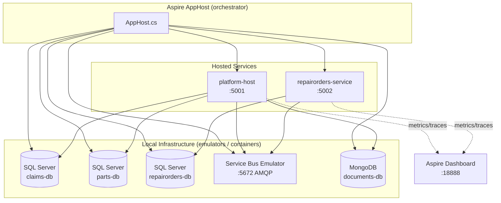
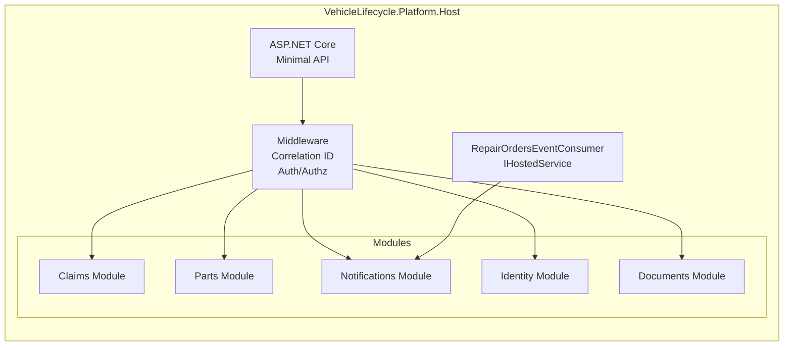
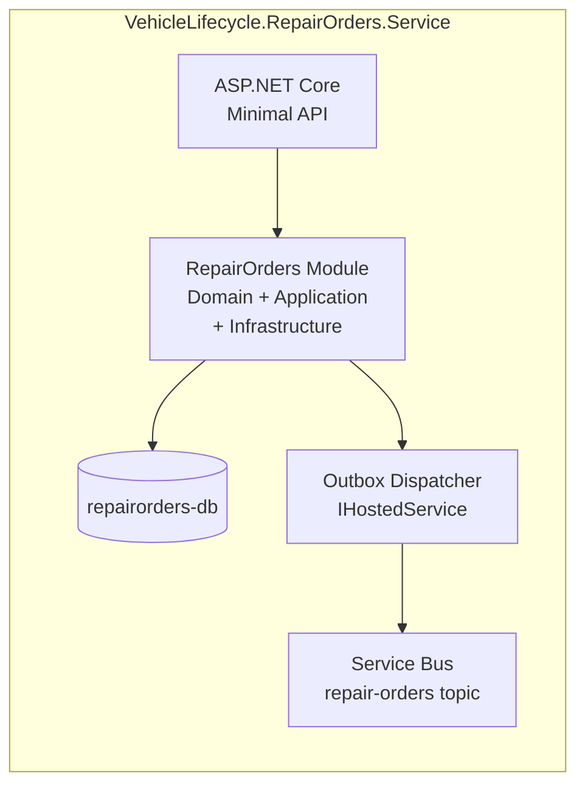
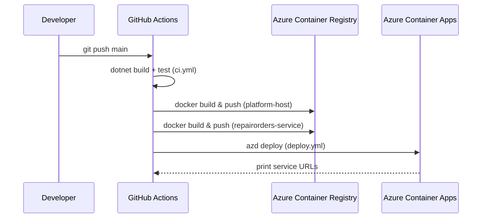
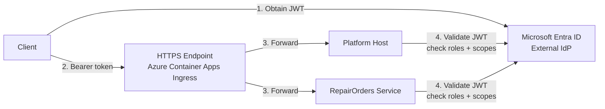

# 13 — System Architecture

## Overview

VehicleLifecycle is a **.NET 10 cloud-native application** built as a **modular monolith with an extracted microservice**, running on **Azure Container Apps** and orchestrated locally with **.NET Aspire**.

The system manages the full lifecycle of vehicles in a service/repair shop context: insurance claims, repair orders, parts catalogue, invoice documents, notifications, and identity.

---

## High-Level Architecture



---

## Local Development Architecture (.NET Aspire)



---

## Component Decomposition

### Platform Host — Modular Monolith

The Platform Host is a single ASP.NET Core process that hosts **five bounded context modules** in one deployment unit. Modules are isolated by project boundaries and communicate only via in-process MediatR or Service Bus integration events.



### RepairOrders Service — Standalone Microservice

Extracted from the monolith in Phase 11. Owns its own database, publishes integration events to Service Bus, and exposes its own API surface.



---

## Module Structure (per bounded context)

Each module follows a **four-layer vertical slice**:

```
VehicleLifecycle.<Module>.Domain          — Entities, Value Objects, Domain Events
VehicleLifecycle.<Module>.Application     — Commands, Queries, Handlers (CQRS), Contracts
VehicleLifecycle.<Module>.Infrastructure  — EF Core DbContext, Repository, Outbox
VehicleLifecycle.<Module>.Api             — Minimal API endpoint registration, DTOs
```

---

## Deployment Pipeline



---

## Security Boundary



All inter-service communication (Service Bus) uses **Managed Identity** — no passwords or connection strings stored in application code.
