# 14 — Design Patterns

This document describes every architectural and design pattern applied in the VehicleLifecycle codebase, with the location of concrete implementations.

---

## 1. Domain-Driven Design (DDD)

The codebase is structured around **Bounded Contexts** — each module is an autonomous domain with its own ubiquitous language, model, and persistence.

### 1.1 Aggregate Root

All domain entities that own a consistency boundary extend `AggregateRoot<TId>` from `VehicleLifecycle.SharedKernel`.

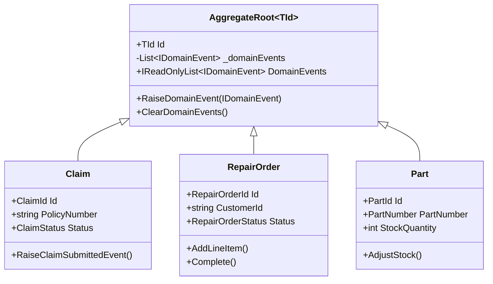

**Location:** `src/BuildingBlocks/VehicleLifecycle.SharedKernel/Domain/AggregateRoot.cs`

### 1.2 Value Object

Immutable domain concepts with structural equality. No identity, compared by value.

| Value Object | Module | Properties |
|---|---|---|
| `ClaimId` | Claims | `Guid Value` |
| `RepairOrderId` | RepairOrders | `Guid Value` |
| `PartId` | Parts | `Guid Value` |
| `PartNumber` | Parts | `string Value` |
| `Money` | Parts | `decimal Amount`, `string Currency` |

**Base class:** `src/BuildingBlocks/VehicleLifecycle.SharedKernel/Domain/ValueObject.cs`

```csharp
// Example: structural equality via GetEqualityComponents()
public sealed class Money : ValueObject
{
	public decimal Amount { get; }
	public string Currency { get; }
	protected override IEnumerable<object?> GetEqualityComponents()
		=> [Amount, Currency];
}
```

### 1.3 Domain Events

Business facts raised inside aggregates and dispatched asynchronously via the outbox.

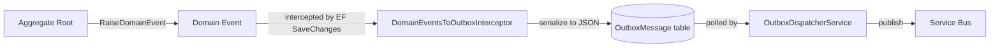

**Location per module:**
- `src/Modules/Claims/VehicleLifecycle.Claims.Domain/Events/`
- `src/Modules/RepairOrders/VehicleLifecycle.RepairOrders.Domain/Events/`
- `src/Modules/Parts/VehicleLifecycle.Parts.Domain/Events/`

### 1.4 Repository Pattern

Each module defines a repository interface in the Application layer and implements it in Infrastructure with EF Core. Modules depend only on the interface — no EF Core reference in Domain or Application.

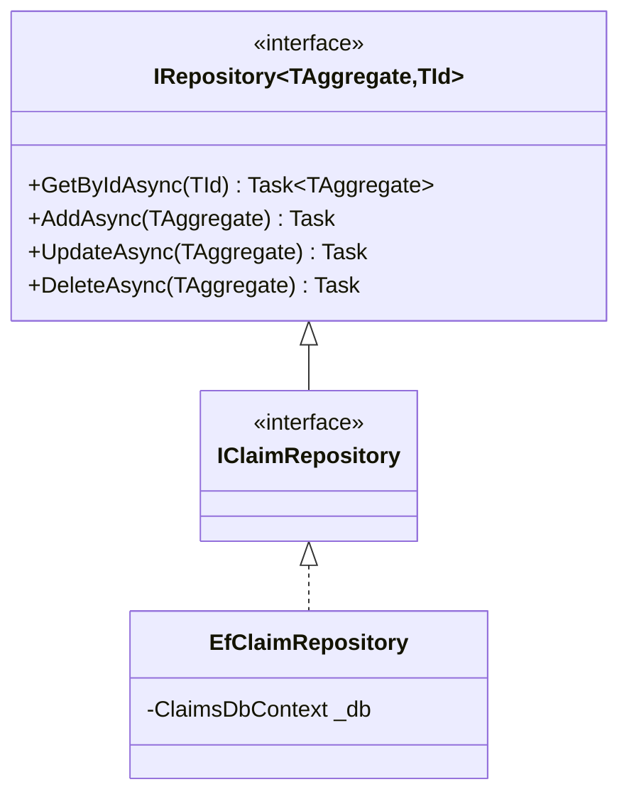

---

## 2. CQRS — Command Query Responsibility Segregation

Every write operation is a **Command** and every read is a **Query**. Both are dispatched via MediatR.

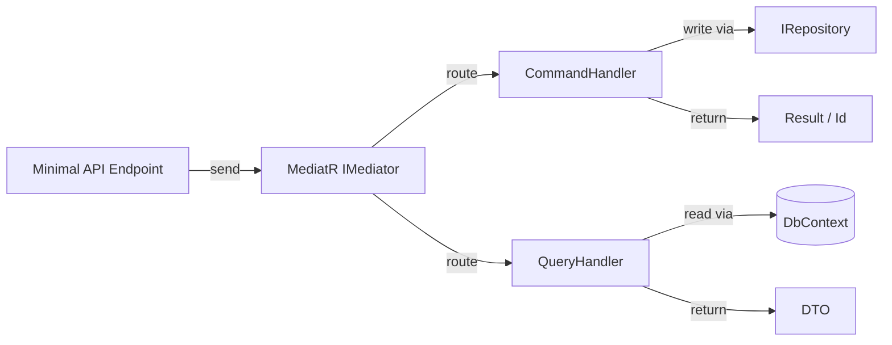

**Commands (examples):**

| Command | Module | Handler |
|---|---|---|
| `SubmitClaimCommand` | Claims | `SubmitClaimCommandHandler` |
| `CreateRepairOrderCommand` | RepairOrders | `CreateRepairOrderCommandHandler` |
| `RegisterPartCommand` | Parts | `RegisterPartCommandHandler` |
| `AdjustStockCommand` | Parts | `AdjustStockCommandHandler` |

**Queries (examples):**

| Query | Module | Returns |
|---|---|---|
| `GetClaimQuery` | Claims | `ClaimDto` |
| `GetRepairOrderQuery` | RepairOrders | `RepairOrderDto` |
| `GetPartQuery` | Parts | `PartDto` |
| `ListPartsByCategoryQuery` | Parts | `IEnumerable<PartDto>` |

---

## 3. Transactional Outbox

Guarantees **at-least-once delivery** of domain events to Service Bus without distributed transactions.

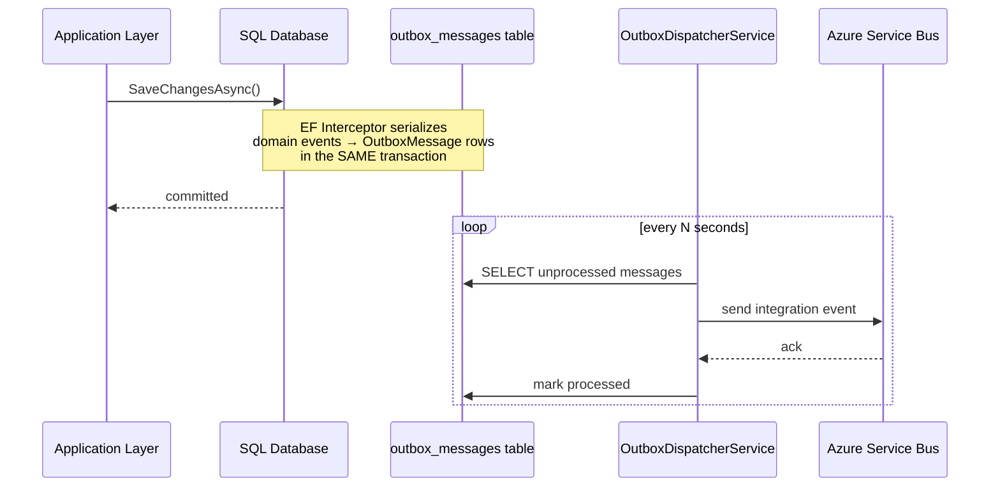

**Key files:**
- `DomainEventsToOutboxInterceptor.cs` — EF SaveChanges interceptor
- `OutboxMessage.cs` — persisted record (Id, Type, Payload, ProcessedAt)
- `OutboxDispatcherService.cs` — `IHostedService` background worker

---

## 4. Mediator Pattern

MediatR decouples request senders from handlers. All cross-cutting concerns (validation, logging, correlation) are added as **pipeline behaviors**.

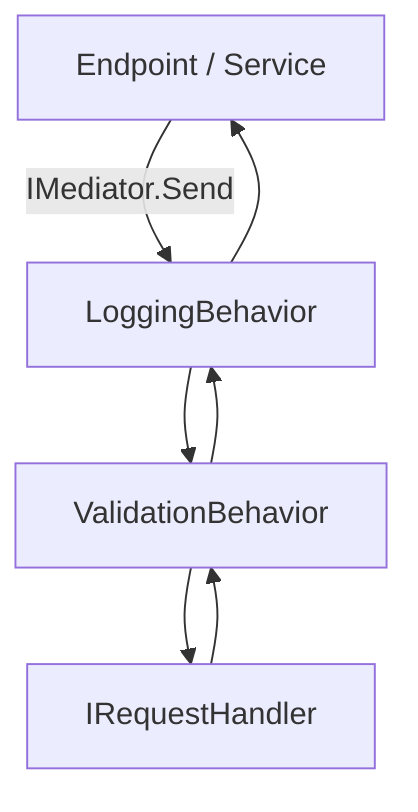

---

## 5. Null Object Pattern — Feature Flags

AI functionality is implemented via a `NullClaimAiAssistant` that returns a placeholder response when the feature flag `Features:AiAssistant:Enabled = false`. This keeps the endpoint wired and testable without requiring a live AI service.

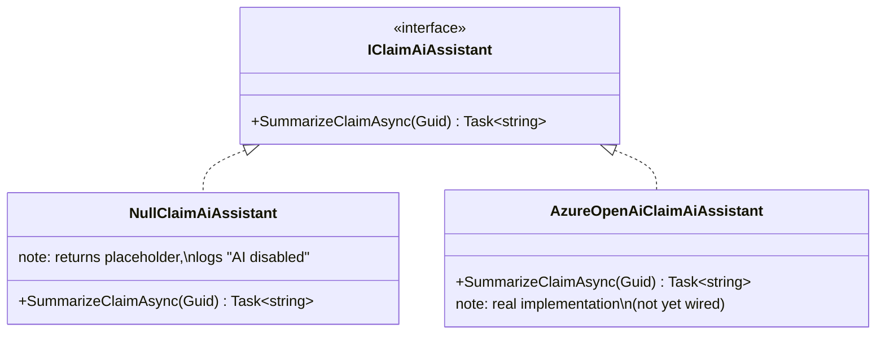

Registration controlled by:
```json
"Features": { "AiAssistant": { "Enabled": false } }
```

---

## 6. Two-Level Hybrid Cache (L1 + L2)

The platform applies a **hybrid caching strategy** that assigns each use-case to the appropriate cache tier based on a single correctness question: *must all running instances agree on this value?*

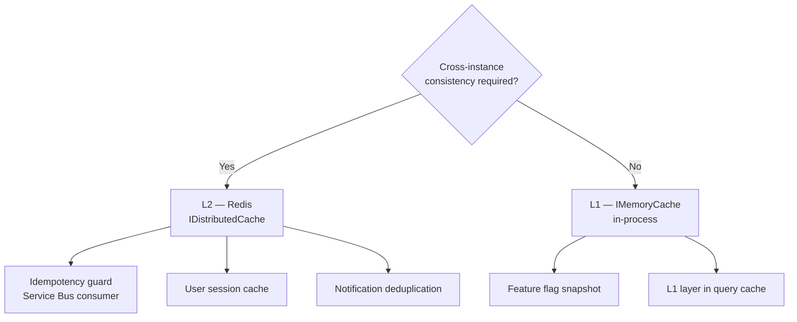

### 6.1 Idempotency Guard — Redis (L2 only)

`RepairOrdersEventConsumer` deduplicates Service Bus messages by `MessageId` using **Redis only** (no L1). This guarantees exactly-once processing even when multiple Platform Host replicas receive the same message from different delivery attempts.

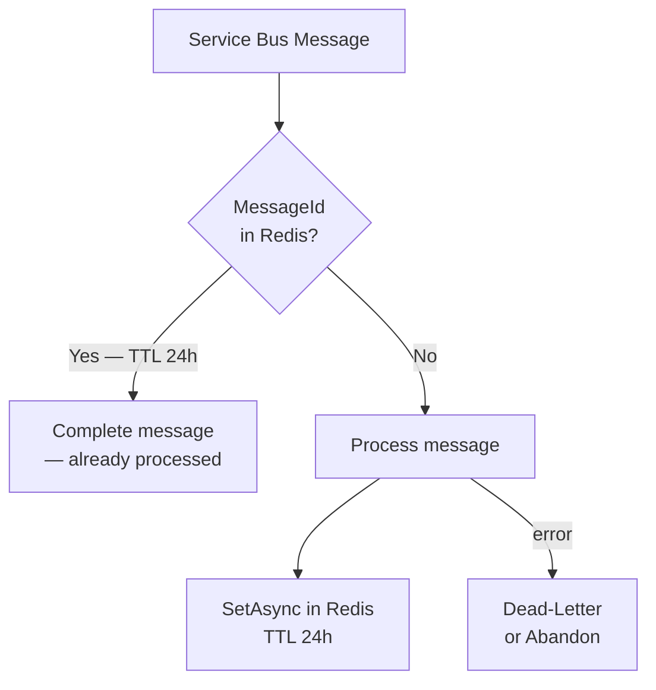

### 6.2 Query Cache — L1 → L2 Read-Through

Frequently-read query results (e.g. parts catalogue lists) use a **read-through** pattern: L1 is checked first (TTL ~30 s), then L2 Redis (TTL ~5 min), then the database. Both levels are populated on a miss.

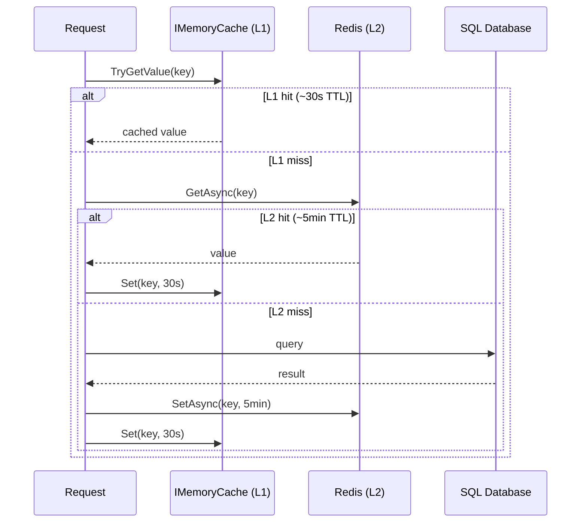

**See also:** [ADR-009](05-architecture-decisions.md#adr-009) · [docs/19-caching-architecture.md](19-caching-architecture.md)

---

## 7. Correlation ID Propagation

Every HTTP request receives a `X-Correlation-Id` header (generated if absent). The ID is stored in `ICorrelationIdAccessor`, injected into log scopes, and forwarded downstream via OpenTelemetry baggage.

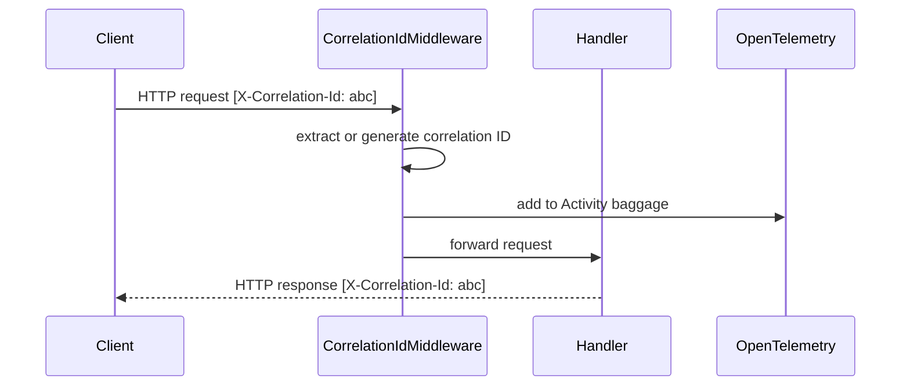

---

## 8. Options Pattern (Configuration)

Strongly-typed configuration sections bound via `IOptions<T>`. No raw `IConfiguration` access in domain or application layers.

| Options Class | Section | Used by |
|---|---|---|
| `AiAssistantOptions` | `Features:AiAssistant` | Claims Infrastructure |
| `ServiceBusOptions` | `ConnectionStrings:servicebus` | Injected by Aspire |
| `SqlOptions` | `ConnectionStrings:*-db` | Injected by Aspire |

---

## 9. Assembly Marker Pattern

Each module exposes an empty marker type (`*AssemblyMarker`) used by MediatR registration to locate handlers without hardcoding assembly names.

```csharp
// Usage in module extension:
services.AddMediatR(cfg =>
	cfg.RegisterServicesFromAssemblyContaining<ClaimsApplicationAssemblyMarker>());
```

---

## 10. Vertical Slice / Modular Monolith

Each bounded context is a self-contained vertical slice with its own:
- Domain model (no cross-module references)
- Application layer (CQRS handlers)
- Infrastructure (separate `DbContext`, own connection string)
- API surface (endpoint registration extension)

Cross-module communication is only allowed via **integration events on Service Bus** — never direct in-process calls between module internals.

---

## 11. MediatR Pipeline Behaviors

Cross-cutting concerns are applied to every MediatR request via `IPipelineBehavior<TRequest, TResponse>`. All behaviors live in `VehicleLifecycle.SharedKernel.Behaviors` and are registered in the shared `AddSharedKernel(...)` extension.

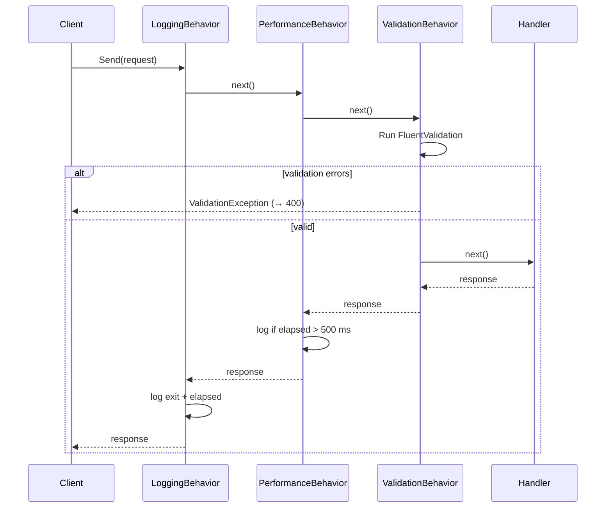

| Behavior | Responsibility |
|---|---|
| `LoggingBehavior` | Structured log on entry and exit with elapsed time |
| `PerformanceBehavior` | Warning log when handler exceeds 500 ms |
| `ValidationBehavior` | Runs all `IValidator<TRequest>` implementations; throws `ValidationException` on failure |

**Location:** `src/BuildingBlocks/VehicleLifecycle.SharedKernel/Behaviors/`

---

## 12. Lightweight Saga (RepairOrder lifecycle)

A **manually-driven saga** tracks the RepairOrder lifecycle across multiple commands without a workflow engine.

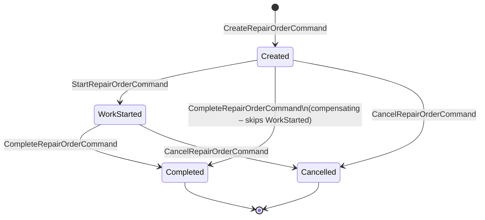

`RepairSagaState` is an EF Core entity stored in `repairorders-db`. Each command handler loads the saga by `RepairOrderId`, calls the appropriate transition method, and saves.

**Location:** `src/Modules/RepairOrders/VehicleLifecycle.RepairOrders.Application/Saga/`

**See also:** [ADR-011](05-architecture-decisions.md#adr-011)

---

## 13. Resilience Pipeline (Service Bus)

All Service Bus send/receive operations are wrapped in a **Polly `ResiliencePipeline`** registered as a singleton in DI.

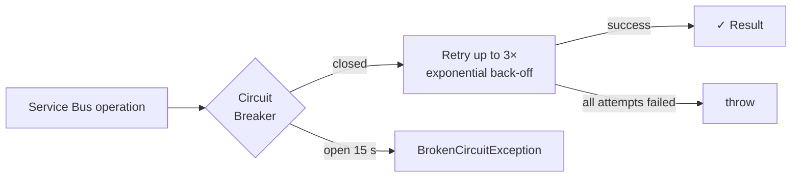

| Strategy | Configuration |
|---|---|
| Retry | 3 attempts, base 2 s, exponential, ±20 % jitter |
| Circuit breaker | 5 failures / 30 s window → open 15 s |

**Location:** `src/BuildingBlocks/VehicleLifecycle.SharedKernel/Resilience/`

**See also:** [ADR-012](05-architecture-decisions.md#adr-012)

---

## 14. Rate Limiting

A fixed-window rate limiting policy `api` is applied to all public endpoints in Platform.Host and RepairOrders.Service.

| Setting | Value |
|---|---|
| Window | 60 seconds |
| Permit limit | 100 requests |
| Partition key | Client IP address |
| Response on exceed | `429 Too Many Requests` |

Endpoints are decorated with `RequireRateLimiting("api")`. The policy is registered via `builder.Services.AddRateLimiter(...)` in each host's `Program.cs`.
