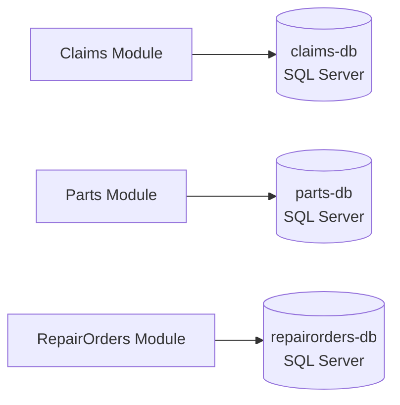
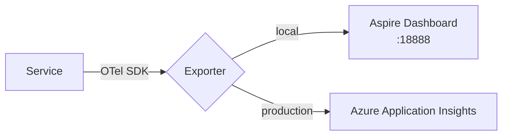
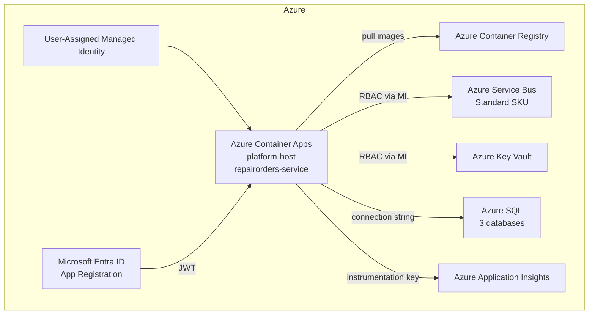

# 15 — Technology Stack

## Runtime & Framework

| Technology | Version | Role | Rationale |
|---|---|---|---|
| **.NET** | 10 | Runtime / SDK | Latest LTS, best performance, minimal API improvements |
| **ASP.NET Core** | 10 | HTTP server, Minimal API | Built-in OpenAPI support, no Swashbuckle needed |
| **C#** | 13 | Language | Records, primary constructors, collection expressions |

---

## Application Framework

| Technology | Version | Role |
|---|---|---|
| **MediatR** | 14.2.0 | CQRS dispatcher — decouples commands/queries from handlers |
| **FluentValidation** | 12.0.0 | Request validation via `IValidator<T>`; integrated with MediatR `ValidationBehavior` |
| **Polly** (`Microsoft.Extensions.Resilience`) | 8.x | Resilience pipelines — retry + circuit breaker for Service Bus operations |
| **ASP.NET Core Rate Limiting** | built-in | Fixed-window policy `api` (100 req / 60 s / IP) on all public endpoints |
| **Microsoft.Identity.Web** | 4.14.x | Entra ID JWT validation, token caching |
| **Microsoft.AspNetCore.OpenApi** | 10.x | Built-in OpenAPI document generation |
| **Scalar.AspNetCore** | latest | Scalar API UI (replaces Swagger UI) |

---

## Persistence

| Technology | Version | Role |
|---|---|---|
| **Entity Framework Core** | 10.x | ORM for all module DbContexts |
| **EF Core SQL Server provider** | 10.x | Azure SQL / SQL Server (local container) |
| **EF Core Migrations** | — | Schema evolution per module |

Each bounded context has its **own `DbContext`** and its **own database**. There are no cross-module foreign keys.

---

## Messaging

| Technology | Version | Role |
|---|---|---|
| **Azure Service Bus** | Standard SKU | Async inter-service messaging via topics/subscriptions |
| **Azure.Messaging.ServiceBus** | 7.x | .NET client for publishers and consumers |
| **Service Bus Emulator** | — | Local development (via Aspire / Docker) |

---

## Caching

| Technology | Level | Role |
|---|---|---|
| **IMemoryCache** | L1 (in-process) | Feature flag snapshots, per-request data, L1 layer in query read-through |
| **Redis** (`StackExchange.Redis`) | L2 (shared, cross-instance) | Idempotency guard, user session, notification deduplication, query L2 |
| **Azure Cache for Redis** | L2 (Azure) | Managed Redis — Basic C0 dev/test, Standard C1 production |
| **HybridCache** (.NET 10) | L1+L2 unified | Future: replaces manual L1→L2 read-through with single abstraction |

See [docs/19-caching-architecture.md](19-caching-architecture.md) for the full strategy and diagrams.

---

## Orchestration & Local Development

| Technology | Role |
|---|---|
| **.NET Aspire** (AppHost) | Local service orchestration, service discovery, resource wiring |
| **Aspire Dashboard** | Local observability UI — traces, logs, metrics |
| **Docker** | SQL Server + Service Bus emulator containers |

---

## Observability

| Technology | Role |
|---|---|
| **OpenTelemetry SDK** | Distributed tracing, metrics, log correlation |
| **Azure Monitor / Application Insights** | Production telemetry export |
| **Aspire ServiceDefaults** | Centralised OTel registration, health checks |
| **ILogger** + OTel log bridge | Structured logging with trace context |

---

## Security

| Technology | Role |
|---|---|
| **Microsoft Entra ID** | External Identity Provider, JWT issuer |
| **Microsoft.Identity.Web** | JWT Bearer middleware, token validation |
| **Azure Managed Identity** | Passwordless auth for Service Bus, Key Vault, SQL |
| **Azure Key Vault** | Secrets management in production |
| **ASP.NET Core Authorization** | Role-based (`AppRoles`) + scope-based (`AppScopes`) policies |

---

## Infrastructure as Code

| Technology | Role |
|---|---|
| **Azure Bicep** | Declarative IaC for all Azure resources |
| **Azure Developer CLI (azd)** | Provision + deploy in one command |
| **GitHub Actions** | CI (`ci.yml`) + CD (`deploy.yml`) pipelines |

---

## Azure Resources (Production)

---

## Testing

| Technology | Role |
|---|---|
| **xUnit** | Unit and integration test runner |
| **FluentAssertions** | Expressive assertions |
| **NSubstitute** | Mocking framework for repository and service fakes |
| **InMemory repositories** | Module integration tests without DB spin-up |

---

## Project / Solution Tooling

| Tool | Role |
|---|---|
| **Visual Studio 2026** (Insiders) | IDE |
| **.NET Aspire** | Solution-level developer experience |
| **.slnx** | New XML-based solution file format |
| **Git / GitHub** | Source control (`wjmail/VehicleLifecycle`) |
