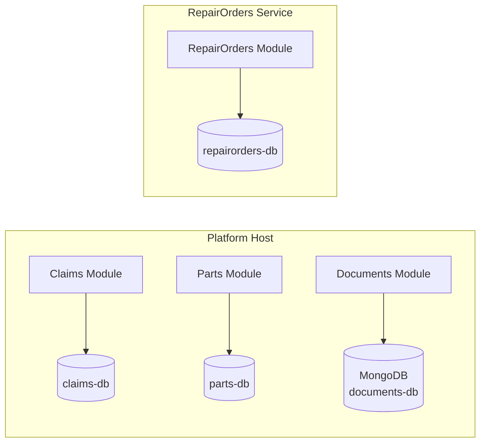
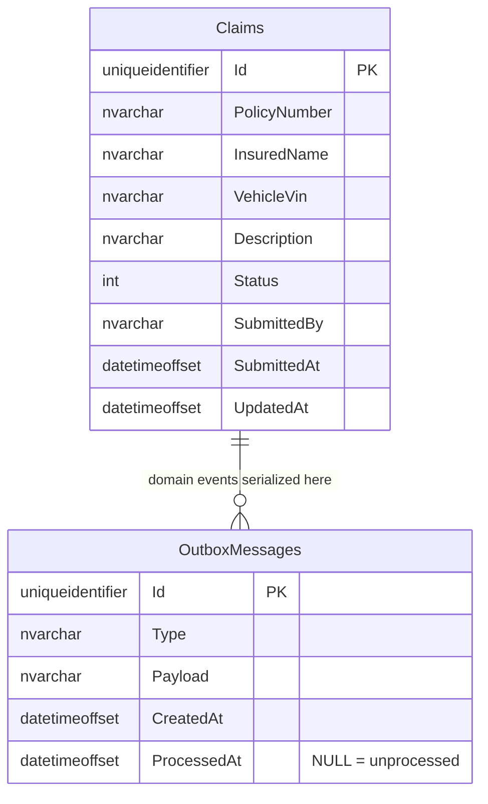
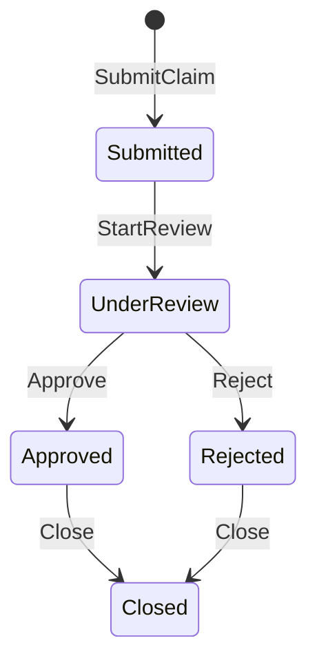
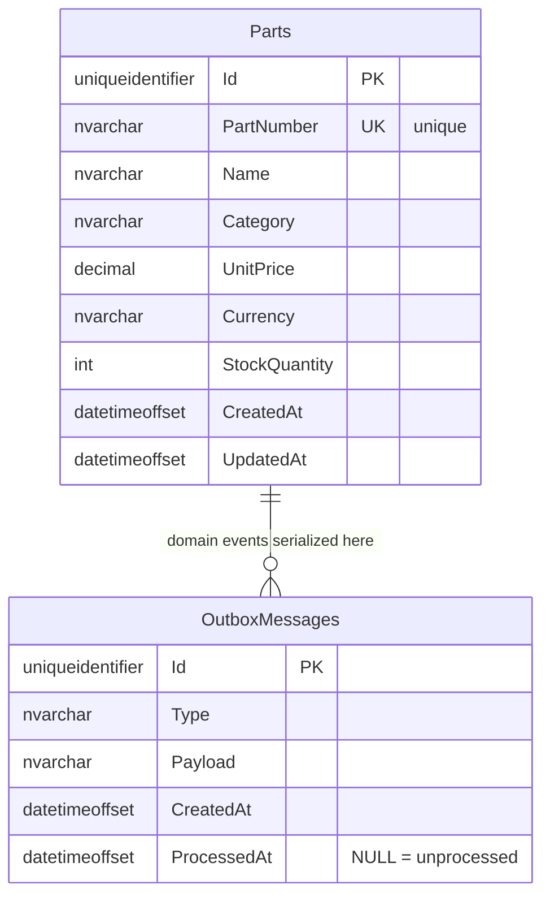
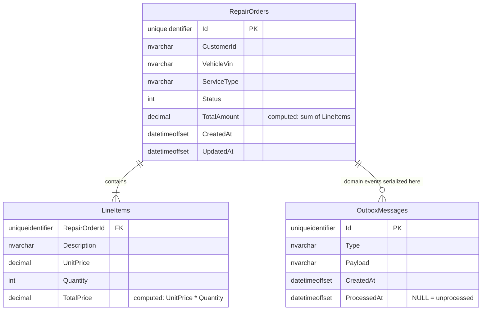
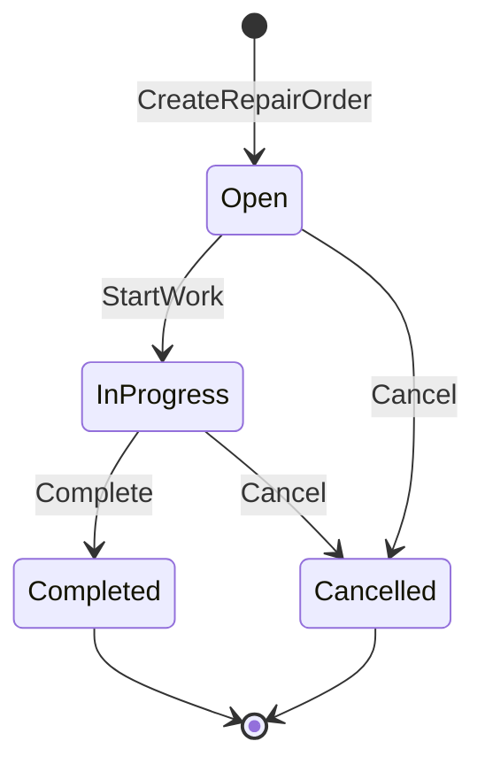

# 16 — Data Architecture

## Principles

- **Database per module** — every bounded context owns its own database. There are no cross-module foreign keys or shared tables.
- **EF Core migrations per SQL module** — each SQL-backed module's `DbContext` manages its own schema independently.
- **MongoDB for Documents** — the Documents module uses MongoDB (Cosmos DB for MongoDB in Azure) with embedded line items; no SQL migrations needed.
- **Outbox table per module** — each module that publishes integration events has its own `outbox_messages` table, written in the same transaction as the domain change.
- **No shared ORM models** — modules never reference each other's `DbContext`.

---

## Database Overview



---

## Claims Database (`claims-db`)

### Entity Relationship Diagram



### ClaimStatus enum

| Value | Meaning |
|---|---|
| `0` — Submitted | Initial state after submission |
| `1` — UnderReview | Assigned to adjuster |
| `2` — Approved | Claim accepted |
| `3` — Rejected | Claim denied |
| `4` — Closed | Final state |

### State Machine



---

## Parts Database (`parts-db`)

### Entity Relationship Diagram



### Domain Model Notes

- `PartNumber` is a **Value Object** — validated on construction, stored as `nvarchar` column via EF owned type.
- `UnitPrice` + `Currency` form the `Money` **Value Object** — stored as two flat columns.
- `StockQuantity` is an invariant: `AdjustStock(delta)` enforces non-negative quantity.

---

## RepairOrders Database (`repairorders-db`)

### Entity Relationship Diagram



### RepairOrderStatus enum

| Value | Meaning |
|---|---|
| `0` — Open | New order, accepting line items |
| `1` — InProgress | Work has started |
| `2` — Completed | Work done, triggers integration event |
| `3` — Cancelled | Terminated with reason |

### State Machine



### LineItem

`LineItem` is a **Value Object** stored as an **owned entity** (EF Core `OwnsMany`). It has no surrogate PK in the domain — the composite of `(RepairOrderId, Description, UnitPrice, Quantity)` defines its identity for equality purposes.

---

## Outbox Table (shared pattern across all modules)

Every module that publishes to Service Bus has an identical `OutboxMessages` table:

```sql
CREATE TABLE OutboxMessages (
	Id          UNIQUEIDENTIFIER  NOT NULL  PRIMARY KEY DEFAULT NEWID(),
	Type        NVARCHAR(500)     NOT NULL,
	Payload     NVARCHAR(MAX)     NOT NULL,  -- JSON-serialized integration event
	CreatedAt   DATETIMEOFFSET    NOT NULL,
	ProcessedAt DATETIMEOFFSET    NULL       -- NULL means unprocessed
);
```

The `OutboxDispatcherService` polls for rows where `ProcessedAt IS NULL`, ordered by `CreatedAt ASC`, processes them in batches, and stamps `ProcessedAt` after successful Service Bus send.

---

## Migration Strategy

Each module runs migrations at startup via:

```csharp
await db.Database.MigrateAsync();
```

This is idempotent and safe for rolling deployments. Migrations are located in:

```
src/Modules/Claims/VehicleLifecycle.Claims.Infrastructure/Migrations/
src/Modules/Parts/VehicleLifecycle.Parts.Infrastructure/Migrations/
src/Modules/RepairOrders/VehicleLifecycle.RepairOrders.Infrastructure/Migrations/
```

To add a new migration (example for Claims):

```bash
dotnet ef migrations add <MigrationName> \
  --project src/Modules/Claims/VehicleLifecycle.Claims.Infrastructure \
  --startup-project src/Platform/VehicleLifecycle.Platform.Host
```

---

## Documents Database (`documents-db`)

The Documents module stores data in **MongoDB** rather than SQL. In production this maps to
**Azure Cosmos DB for MongoDB** API.

### Collection: `invoices`

Each invoice is a single BSON document. Line items are **embedded** inside the invoice —
there is no separate collection for line items.

```json
{
  "_id": "<InvoiceId (UUID)>",
  "repairOrderId": "<UUID>",
  "status": "Issued",
  "currency": "PLN",
  "totalNet": 1200.00,
  "totalGross": 1476.00,
  "createdAt": "2025-07-01T09:00:00Z",
  "issuedAt": "2025-07-01T09:00:05Z",
  "paidAt": null,
  "cancelledAt": null,
  "lineItems": [
	{
	  "description": "Oil change",
	  "quantity": 1,
	  "unitPrice": 150.00,
	  "taxRate": 0.23,
	  "discountRate": 0.00
	},
	{
	  "description": "Brake pads (front)",
	  "quantity": 2,
	  "unitPrice": 250.00,
	  "taxRate": 0.23,
	  "discountRate": 0.05
	}
  ]
}
```

### Indexes

| Field | Type | Purpose |
|---|---|---|
| `_id` | Unique | Primary key (InvoiceId) |
| `repairOrderId` | Non-unique | Fast lookup by repair order |
| `status` | Non-unique | Filter by lifecycle state |

### BSON serialization

- `InvoiceId` is serialized as `BsonBinaryData` (UUID subtype 4) via `InvoiceIdSerializer`.
- Registered in `DocumentsBsonConfiguration.Register()`, called at application startup.

### No migrations

MongoDB is schema-less. Adding new fields to the document requires no migration script.
The repository ignores unknown BSON fields by default.

### Local development

`AppHost.cs` starts a MongoDB container with a named data volume:

```csharp
var mongo = builder.AddMongoDB("mongodb").WithDataVolume();
platform.WithReference(mongo).WaitFor(mongo);
```

Connection string is injected as `ConnectionStrings:mongodb` and consumed by
`DocumentsInfrastructureExtensions.AddDocumentsInfrastructure`.

