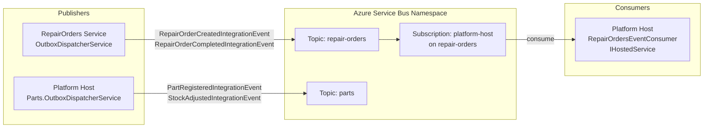
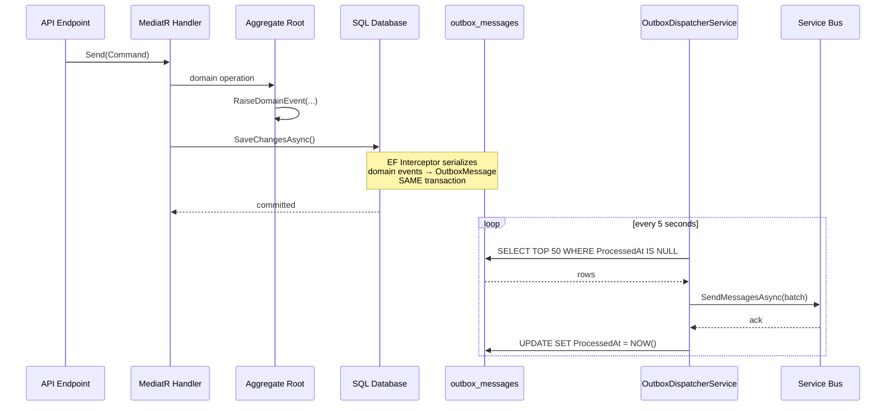
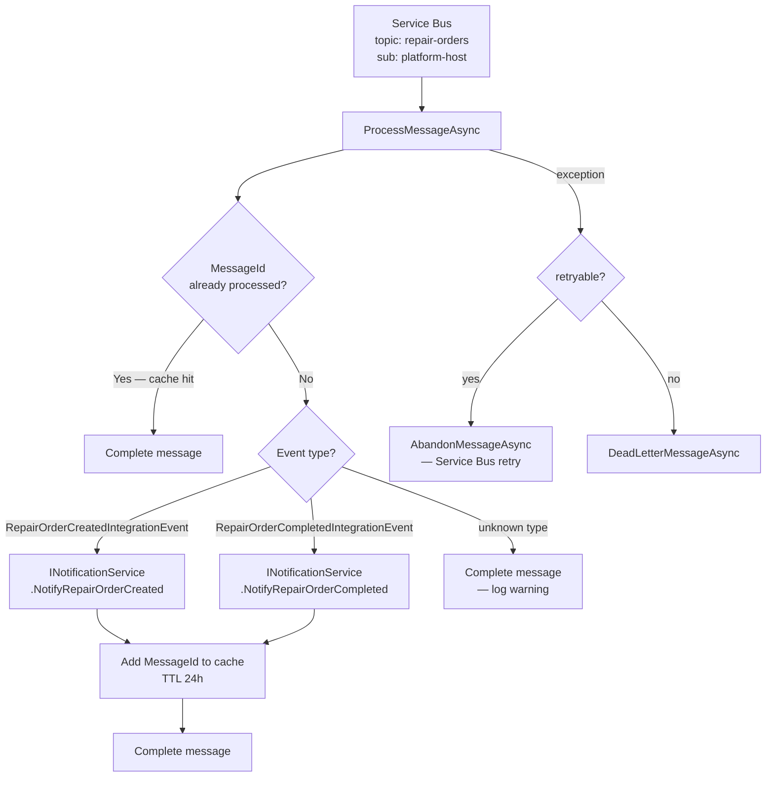
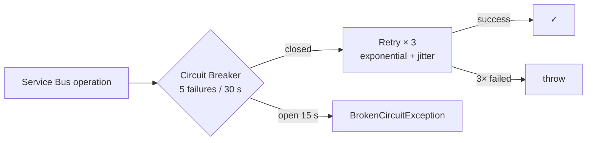
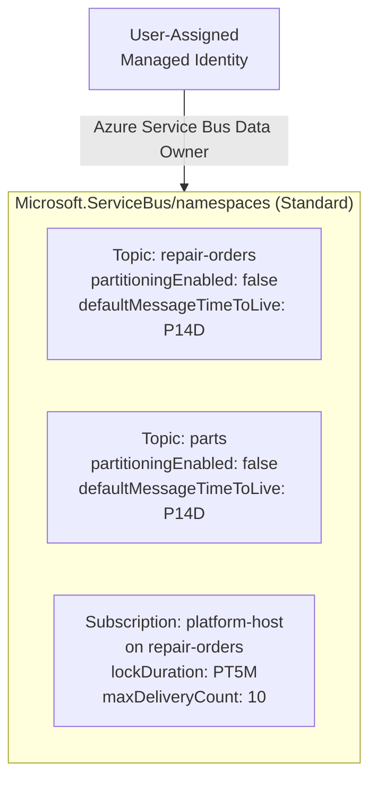

# 17 — Messaging Architecture

## Overview

VehicleLifecycle uses **Azure Service Bus (Standard SKU)** with the **topic/subscription model** for all async inter-service communication. Publishers never call subscribers directly — all cross-boundary events flow through Service Bus.

---

## Topic & Subscription Map



---

## Integration Events Catalog

### Topic: `repair-orders`

| Event | Namespace | Raised when |
|---|---|---|
| `RepairOrderCreatedIntegrationEvent` | `VehicleLifecycle.Contracts.IntegrationEvents.RepairOrders` | New repair order is opened |
| `RepairOrderCompletedIntegrationEvent` | `VehicleLifecycle.Contracts.IntegrationEvents.RepairOrders` | Repair order work is completed |

**Payload — RepairOrderCreatedIntegrationEvent:**
```json
{
  "RepairOrderId": "3fa85f64-...",
  "CustomerId": "CUST-001",
  "VehicleVin": "WBA12345678",
  "ServiceType": "FullService",
  "OccurredOn": "2026-08-01T22:00:00Z"
}
```

**Payload — RepairOrderCompletedIntegrationEvent:**
```json
{
  "RepairOrderId": "3fa85f64-...",
  "CustomerId": "CUST-001",
  "TotalAmount": 1250.00,
  "OccurredOn": "2026-08-01T23:00:00Z"
}
```

### Topic: `parts`

| Event | Namespace | Raised when |
|---|---|---|
| `PartRegisteredIntegrationEvent` | `VehicleLifecycle.Contracts.IntegrationEvents.Parts` | New part is added to catalogue |
| `StockAdjustedIntegrationEvent` | `VehicleLifecycle.Contracts.IntegrationEvents.Parts` | Stock quantity changes |

**Payload — PartRegisteredIntegrationEvent:**
```json
{
  "PartId": "abc12345-...",
  "PartNumber": "BR-4821",
  "Name": "Brake Pad Set",
  "Category": "Brakes",
  "OccurredOn": "2026-08-01T10:00:00Z"
}
```

**Payload — StockAdjustedIntegrationEvent:**
```json
{
  "PartId": "abc12345-...",
  "PartNumber": "BR-4821",
  "PreviousQuantity": 10,
  "NewQuantity": 15,
  "Delta": 5,
  "Reason": "Restocking",
  "OccurredOn": "2026-08-01T11:00:00Z"
}
```

---

## Transactional Outbox Flow

The outbox pattern guarantees **at-least-once delivery** without distributed transactions. A domain change and its outbox record are committed in a single SQL transaction.



### OutboxMessage structure

```
Id          GUID        — message identity
Type        string      — CLR type name of the integration event
Payload     JSON        — serialized integration event
CreatedAt   datetime    — when domain event was raised
ProcessedAt datetime?   — NULL until successfully sent to Service Bus
```

---

## Consumer: RepairOrdersEventConsumer

The `Platform.Host` subscribes to the `repair-orders` topic via subscription `platform-host` and processes integration events as an `IHostedService`.



### Idempotency Guard

```csharp
// MessageId used as cache key — 24h TTL
if (_cache.TryGetValue(message.MessageId, out _))
{
	await args.CompleteMessageAsync(message, ct);
	return;
}
```

Service Bus guarantees **at-least-once** delivery. The idempotency guard ensures **effectively-once** processing.

---

## Resilience Pipeline

All Service Bus send and receive operations are wrapped in a **Polly `ResiliencePipeline`** to handle transient faults and prevent cascading failures.



| Strategy | Parameters |
|---|---|
| Retry | 3 attempts, base 2 s, exponential, ±20 % jitter |
| Circuit breaker | 5 failures in 30 s window → open for 15 s |

The pipeline is registered as a singleton in DI (`ResiliencePipeline` from `Microsoft.Extensions.Resilience`) and shared by both the outbox dispatcher and event consumers within a process.

---

## Dead-Letter Queue Monitor

`DeadLetterMonitorService` is an `IHostedService` registered in Platform.Host. It polls the `repair-orders / platform-host` DLQ every **5 minutes** and emits a structured warning log for each unprocessed message. This makes dead-lettered messages visible in Application Insights without requiring manual portal inspection.

```csharp
// Polling interval
TimeSpan.FromMinutes(5)

// Log emitted per DLQ message
_logger.LogWarning(
	"Dead-lettered message {MessageId} subject={Subject} reason={Reason}",
	msg.MessageId, msg.Subject, msg.DeadLetterReason);
```

Configure an Application Insights alert on log severity `Warning` + message pattern `Dead-lettered message` to get notified automatically.

---

## RepairOrder Saga and Messaging

When a `RepairOrderCreatedIntegrationEvent` is consumed, the consumer also interacts with the `RepairSagaState` via `IRepairSagaRepository`. The saga lifecycle is driven by three commands:

| HTTP endpoint | Command | Saga transition |
|---|---|---|
| `POST /repair-orders` | `CreateRepairOrderCommand` | `→ Created` |
| `POST /repair-orders/{id}/start` | `StartRepairOrderCommand` | `Created → WorkStarted` |
| `POST /repair-orders/{id}/complete` | `CompleteRepairOrderCommand` | `WorkStarted → Completed` |

The complete command includes a compensating `RecordWorkStarted()` call if the saga is still in `Created` state, ensuring the transition `Created → WorkStarted → Completed` is always valid even when start was skipped.

**See also:** [ADR-011](05-architecture-decisions.md#adr-011) · [docs/14-design-patterns.md#12-lightweight-saga](14-design-patterns.md)


---

## Error Handling & Dead-Letter Queue

| Scenario | Action |
|---|---|
| Transient exception (timeout, DB unavailable) | `AbandonMessageAsync` → SB retries up to `MaxDeliveryCount` |
| Deserialization error | `DeadLetterMessageAsync` with reason |
| Unknown event type | `CompleteMessageAsync` + warning log (safe to ignore) |
| `MaxDeliveryCount` exceeded | Service Bus automatically moves to DLQ |

The DLQ is inspectable via Azure Portal or:
```bash
az servicebus topic subscription show \
  --resource-group <rg> --namespace-name <ns> \
  --topic-name repair-orders --name platform-host \
  --query deadLetterMessageCount
```

---

## Local Development — Service Bus Emulator

In local Aspire runs, the Service Bus emulator is started as a Docker container:

```csharp
// AppHost.cs
var serviceBus = builder.AddAzureServiceBus("servicebus")
	.RunAsEmulator();

serviceBus.AddServiceBusTopic("repair-orders")
	.AddServiceBusSubscription("platform-host");

serviceBus.AddServiceBusTopic("parts");
```

The emulator exposes AMQP on `:5672`. Connection strings are injected automatically by Aspire — no manual configuration needed.

---

## Infrastructure (Bicep)



Both `platform-host` and `repairorders-service` use the same **User-Assigned Managed Identity** with `Azure Service Bus Data Owner` role — no connection strings, no SAS keys.

---

## Constants Reference

```csharp
// VehicleLifecycle.Contracts.IntegrationEvents.ServiceBusTopics
public static class ServiceBusTopics
{
	public const string RepairOrders = "repair-orders";
	public const string Parts        = "parts";

	public static class Subscriptions
	{
		public const string PlatformHost = "platform-host";
	}
}
```
