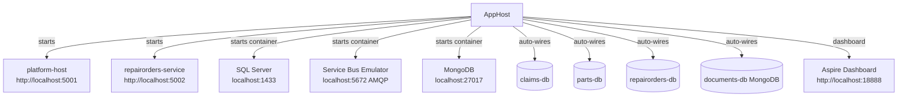

# 18 — Local Development Guide

## Prerequisites

| Tool | Version | Notes |
|---|---|---|
| **.NET SDK** | 10.x | [download](https://dotnet.microsoft.com/download) |
| **Docker Desktop** | latest | Required for SQL Server + Service Bus emulator containers |
| **Visual Studio 2026** (Insiders) or **VS Code** | latest | VS has native Aspire integration |
| **Azure CLI** | latest | Optional — only needed for azd deploys |
| **azd** | latest | Optional — only needed for Azure provisioning |

> **Docker must be running** before starting the AppHost — Aspire will automatically pull and start `mcr.microsoft.com/mssql/server`, the Service Bus emulator, and a MongoDB container.

---

## Repository Structure

```
NewTechnologies/
├── src/
│   ├── AppHost/                          ← Aspire orchestrator (start here)
│   ├── ServiceDefaults/                  ← Shared OTel / health check wiring
│   ├── Platform/
│   └── VehicleLifecycle.Platform.Host/   ← Modular monolith (Claims, Parts, Notifications, Identity, Documents)
│   ├── Services/
│   │   └── VehicleLifecycle.RepairOrders.Service/  ← Standalone microservice
│   ├── Modules/
│   │   ├── Claims/
│   │   ├── Parts/
│   │   ├── RepairOrders/
│   │   ├── Notifications/
│   │   ├── Identity/
│   │   └── Documents/
│   └── BuildingBlocks/
│       ├── VehicleLifecycle.SharedKernel/
│       └── VehicleLifecycle.Contracts/
├── infra/                                ← Bicep IaC
├── docs/                                 ← Architecture documentation
└── tests/
```

---

## Quick Start

### 1. Clone the repository

```bash
git clone <repository-url>
cd VehicleLifecycle
```

### 2. Open the solution

Open in Visual Studio:
```
src/VehicleLifecycle.Platform.slnx
```

Or from the terminal:
```bash
start src/VehicleLifecycle.Platform.slnx
```

### 3. Set the startup project to AppHost

In Visual Studio: right-click `VehicleLifecycle.AppHost` → **Set as Startup Project**.

Or from CLI:
```bash
dotnet run --project src/AppHost/VehicleLifecycle.AppHost.csproj
```

### 4. Accept Docker prompts

On first run, Docker will pull:
- `mcr.microsoft.com/mssql/server:2022-latest` (~1.5 GB)
- Azure Service Bus emulator image
- `mongo:latest` (MongoDB, ~700 MB)

This happens once and is cached locally.

### 5. Open the Aspire Dashboard

After startup, the console prints:
```
Login to the dashboard at: http://localhost:18888/login?t=<token>
```

Open that URL to see all services, logs, traces, and metrics.

---

## What Aspire Starts



All connection strings, Service Bus endpoints, and database names are **injected automatically by Aspire** — no manual `appsettings.json` configuration needed for local development.

---

## API Documentation (Scalar UI)

Both services expose Scalar UI in Development mode:

| Service | Scalar URL |
|---|---|
| Platform Host (Claims, Parts) | http://localhost:5001/scalar/v1 |
| RepairOrders Service | http://localhost:5002/scalar/v1 |

OpenAPI JSON documents:
- http://localhost:5001/openapi/v1.json
- http://localhost:5002/openapi/v1.json

---

## Database Migrations

Migrations run **automatically at startup** via `db.Database.MigrateAsync()` in each module's infrastructure extension.

To add a new migration manually:

```bash
# Claims
dotnet ef migrations add <Name> \
  --project src/Modules/Claims/VehicleLifecycle.Claims.Infrastructure \
  --startup-project src/Platform/VehicleLifecycle.Platform.Host

# Parts
dotnet ef migrations add <Name> \
  --project src/Modules/Parts/VehicleLifecycle.Parts.Infrastructure \
  --startup-project src/Platform/VehicleLifecycle.Platform.Host

# RepairOrders
dotnet ef migrations add <Name> \
  --project src/Modules/RepairOrders/VehicleLifecycle.RepairOrders.Infrastructure \
  --startup-project src/Services/VehicleLifecycle.RepairOrders.Service
```

---

## Running Tests

```bash
dotnet test src/VehicleLifecycle.Platform.slnx
```

Or from Visual Studio: **Test → Run All Tests** (`Ctrl+R, A`).

Current status: **42 tests / 0 failures**.

---

## Configuration Reference

### Authentication — local bypass

By default, **no Entra ID credentials are required for local development**.

The `Features:DisableAuthentication = true` flag (set in `appsettings.Development.json` for both
the Platform Host and the RepairOrders Service) activates `LocalDevAuthHandler`, which
automatically authenticates every request as a synthetic admin principal that holds all roles
and scopes.

You will see this warning in the console when the bypass is active:

```
WARNING: Authentication is DISABLED — all requests are automatically authenticated as local dev user.
```

To test with real Entra ID credentials locally, see
[08-security-model.md — Option B](08-security-model.md#option-b--real-entra-id-everywhere).

### Feature flags

| Flag | Dev default | Production default | Effect |
|---|---|---|---|
| `Features:DisableAuthentication` | `true` | `false` | `true` → all requests auto-authenticated; no Entra ID needed |
| `Features:AiAssistant:Enabled` | `true` | `false` | `true` → Claims `/summarize` endpoint calls Ollama (or Azure OpenAI) |

Current `appsettings.Development.json` (Platform Host):

```json
{
  "Features": {
	"DisableAuthentication": true,
	"AiAssistant": { "Enabled": true }
  },
  "AiAssistant": {
	"Provider": "Ollama",
	"Ollama": { "BaseUrl": "http://localhost:11434", "Model": "mistral" }
  }
}
```

When `AiAssistant:Enabled: false`, `POST /api/v1/claims/{id}/summarize` returns a placeholder
response without calling any AI service.

---

## Service Bus Emulator (local)

The emulator is started automatically by Aspire. No manual configuration required.

Topics created by AppHost:
- `repair-orders` with subscription `platform-host`
- `parts` (no subscriber yet)

To inspect emulator state, use the Aspire Dashboard → Resources → servicebus.

---

## Troubleshooting

### Docker not running

```
Error: Docker is not running. Start Docker Desktop and try again.
```
**Fix:** Start Docker Desktop before running the AppHost.

### SQL Server port conflict

If port `1433` is in use by another SQL Server instance:

In `AppHost.cs`, add `.WithHostPort(1444)` to the SQL Server resource:
```csharp
var sqlServer = builder.AddSqlServer("sql", sqlPassword)
	.WithDataVolume()
	.WithHostPort(1444);  // use a free port
```

### Service Bus emulator not ready

Aspire uses `.WaitFor(serviceBus)` — if the emulator takes >30 s to start, increase the wait timeout in Docker Desktop settings (Memory: min 4 GB recommended).

### Migrations fail on first run

Ensure Docker is fully started and the SQL Server container health check passes (visible in Aspire Dashboard → Resources → sql → Healthy).

---

## Useful Commands

```bash
# Build entire solution
dotnet build src/VehicleLifecycle.Platform.slnx

# Run tests
dotnet test src/VehicleLifecycle.Platform.slnx

# Run AppHost directly
dotnet run --project src/AppHost/VehicleLifecycle.AppHost.csproj

# Provision Azure infrastructure (requires azd login)
azd provision

# Deploy to Azure
azd deploy
```
