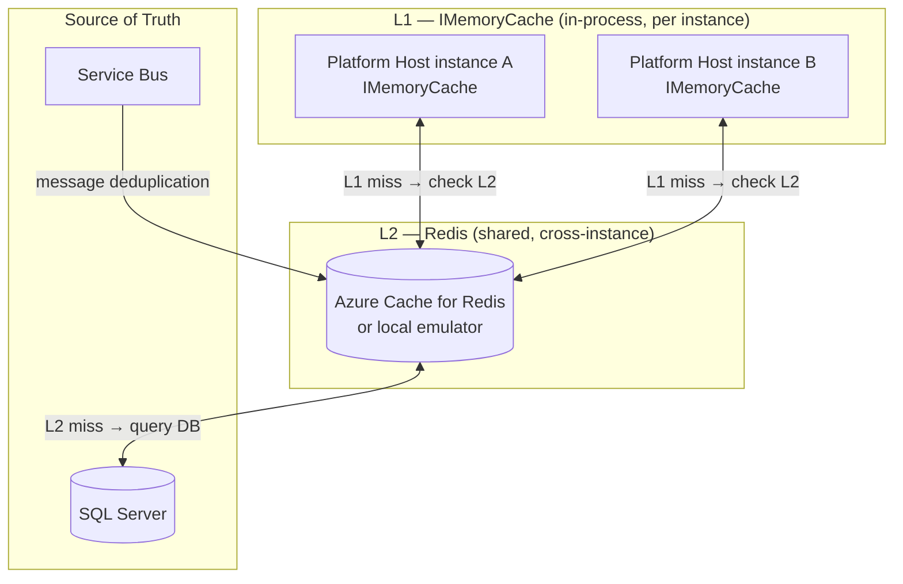
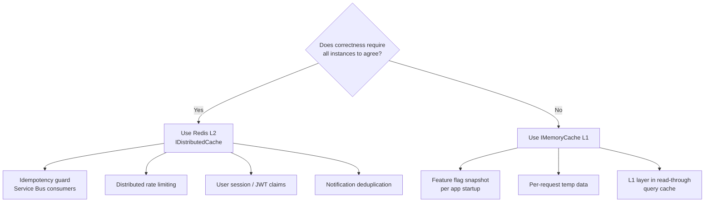
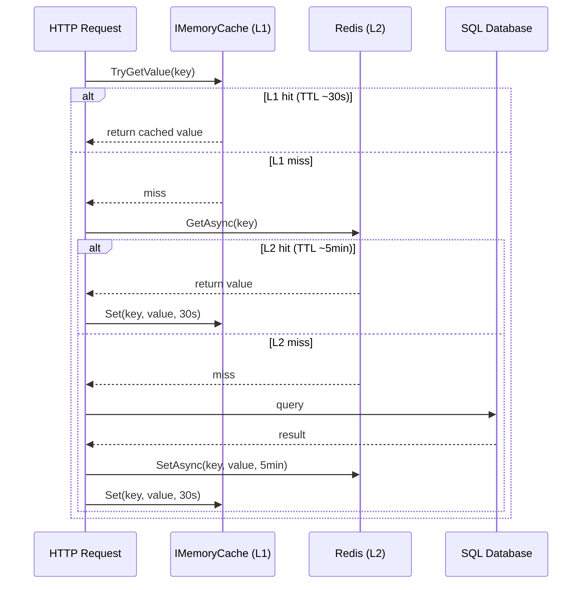
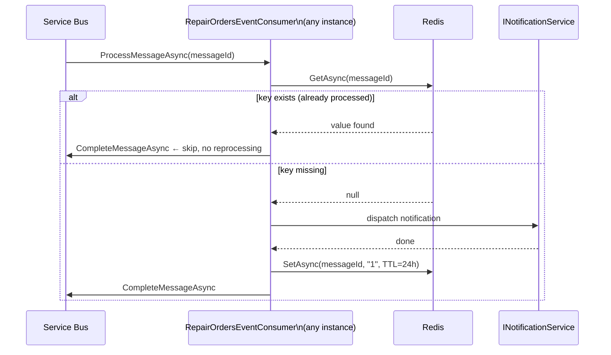

# 19 — Caching Architecture

## Strategy: Two-Level Hybrid Cache (L1 + L2)

The platform uses a **two-level caching strategy** that matches cache technology to the correctness requirements of each use-case.



---

## Decision Rule



---

## Use-Case Map

| Use-case | Cache level | Technology | TTL | Notes |
|---|---|---|---|---|
| **Service Bus idempotency guard** | L2 only | Redis | 24 h | Must be shared — multiple instances consume same topic |
| **Query cache** (e.g. parts list) | L1 → L2 read-through | IMemoryCache + Redis | L1: 30 s / L2: 5 min | L1 absorbs hot traffic; L2 prevents DB stampede |
| **Feature flag snapshot** | L1 only | IMemoryCache | App lifetime | Read once at startup; no cross-instance coordination needed |
| **User session / JWT claims cache** | L2 only | Redis | Token lifetime | Revocation must propagate to all instances |
| **Notification deduplication** (future) | L2 only | Redis | 48 h | Prevent duplicate emails/SMS across instances |
| **Rate limiting counters** (future) | L2 only | Redis | Window duration | Per-user or per-IP across all replicas |

---

## L1 → L2 Read-Through Flow (Query Cache)



---

## Idempotency Guard Flow (Redis Only)

`RepairOrdersEventConsumer` uses Redis directly — no L1, because every check must see all previously processed message IDs regardless of which instance handled them.



---

## Infrastructure

### Local (.NET Aspire)

```csharp
// AppHost.cs  (to be added)
var redis = builder.AddRedis("redis").RunAsContainer();

builder.AddProject<Projects.VehicleLifecycle_Platform_Host>("platform-host")
	// ...existing references...
	.WithReference(redis).WaitFor(redis);
```

Aspire starts a `redis:latest` Docker container and injects `ConnectionStrings__redis` automatically.

### Azure (Bicep — to be added: `infra/modules/redis.bicep`)

```bicep
resource redis 'Microsoft.Cache/redis@2023-08-01' = {
  name: 'redis-${resourceToken}'
  location: location
  properties: {
	sku: { name: 'Basic', family: 'C', capacity: 0 }   // C0 dev/test
	enableNonSslPort: false
	minimumTlsVersion: '1.2'
  }
}
```

Production uses **Standard C1** (with replica) for HA. Access from ACA via **Managed Identity** using the `Redis Cache Contributor` role (or connection string from Key Vault).

---

## .NET Registration

```csharp
// Program.cs (Platform Host)

// Aspire wires this automatically from AppHost .WithReference(redis)
// Manual fallback:
builder.Services.AddStackExchangeRedisCache(options =>
{
	options.Configuration = builder.Configuration.GetConnectionString("redis");
});

// IMemoryCache — still registered for L1
builder.Services.AddMemoryCache();
```

---

## Future: HybridCache (.NET 9+)

`Microsoft.Extensions.Caching.Hybrid` (available in .NET 9, stable in .NET 10) provides a single `HybridCache` abstraction that internally manages L1 + L2 with stampede protection, serialization, and tag-based invalidation. When adopted, the manual L1→L2 read-through pattern above can be replaced with:

```csharp
// One call handles L1 check → L2 check → DB fallback → both levels populated
var result = await hybridCache.GetOrCreateAsync(
	key,
	async ct => await db.Parts.Where(...).ToListAsync(ct),
	new HybridCacheEntryOptions { Expiration = TimeSpan.FromMinutes(5) });
```

Migration path: replace `IMemoryCache` + `IDistributedCache` dual injections with `HybridCache` injection — no behavior change, less boilerplate.

---

## Related Documents

- [ADR-009](05-architecture-decisions.md#adr-009) — decision record for this strategy
- [docs/17-messaging-architecture.md](17-messaging-architecture.md) — idempotency guard context
- [docs/15-technology-stack.md](15-technology-stack.md) — Redis in the tech stack
